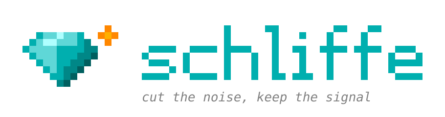
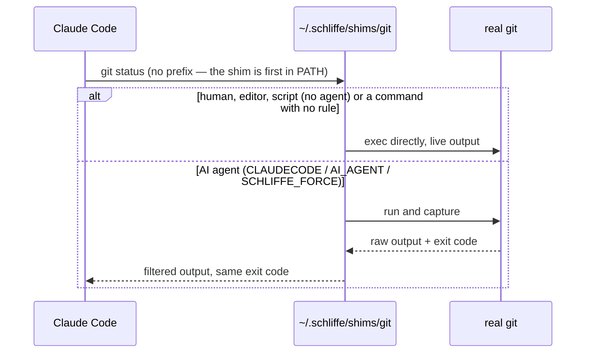

<div align="center">



**Cuts the noise out of what AI coding agents read — command output, MCP results and images — without hiding what matters.**

[](LICENSE)
[](Cargo.toml)
[](https://github.com/mkmuniz/schliffe-tk/actions/workflows/ci.yml)
[](https://github.com/mkmuniz/schliffe-tk/releases/latest)

</div>

---

## What it does

When Claude Code (or another agent) runs `git diff`, `pnpm build` or `cargo test`, it reads the whole output — progress bars, padding, 190 remote branches, one line per passing test. Schliffe sits in between and hands the agent a compact version:

- **Same command, no prefix.** The agent runs `git log`; Schliffe answers. Nothing to configure per project.
- **Only for AI agents.** You, your editor, git hooks and scripts get the untouched output.
- **Nothing is lost.** Every cut is marked, and `schliffe show <hash>` returns the original.

```text
$ git log -3                       # as the agent sees it
5fab882a05 2026-09-24 23:31 Mkmuniz — MCP: never compress file reads, recoverable trims, crash handling
e734d79dc1 2026-09-24 23:24 Mkmuniz — Add end-to-end tests against the compiled binary
cd0a83980c 2026-09-24 23:21 Mkmuniz — Layer B: stderr support and first batch of long-tail filters
[+16 lines omitted]
(full output: schliffe show a3b5335212fe6e0a)
```

## Install

Requires [Rust](https://rustup.rs). Takes about 2 minutes (it builds from source).

1. Clone and install:
   ```bash
   git clone https://github.com/mkmuniz/schliffe-tk.git
   cd schliffe-tk
   bash install.sh
   ```
2. Open a new terminal. In VS Code, run **Reload Window**.
3. Start a new Claude Code session.

`install.sh` puts the shims first in your `PATH` (bash and zsh), registers the Claude Code hook, and migrates an old Elagix install if there is one. Windows: see [Platforms](#platforms).

## Check it's working

```bash
which git        # → ~/.schliffe/shims/git
schliffe stats   # savings so far
```

```text
             commands filtered     before      after  saved ~tokens saved
last 24h          103       32    97.8 KB    49.4 KB   -50%         12.4k

top savings (all time):
  git diff                     4×     65.5 KB →    25.6 KB   -61%
  git log                     12×      8.4 KB →     3.9 KB   -54%

passed through with no filter (candidates for a new rule):
  git status 14×, git commit 11×, git add 10×, ...
```

`stats` logs only command names and sizes (`~/.schliffe/stats.log`) — never arguments or output.

## Results

Measured on real repositories, bytes before → after (tokens ≈ bytes / 4):

| Command | Before → After | Cut |
|---|---|---|
| `cargo test` (2 suites, all passing) | 7,818 → 124 B | −98% |
| `git pull` (26 files) | 2,467 → 151 B | −94% |
| `git branch -a` (190 remote branches) | 10,258 → 850 B | −92% |
| `git show HEAD` | 10,527 → 1,441 B | −86% |
| `git log -30` | 12,039 → 2,323 B | −81% |
| `docker build` | 1,492 → 292 B | −80% |
| `git diff` (62 files) | 248,098 → 51,234 B | −79% |
| MCP `tools/list` (real server, 14 tools) | 13,018 → 2,940 B | −77% |
| `pnpm build` (Next.js) | 1,070 → 255 B | −76% |
| `git status` | 258 → 62 B | −76% |
| `npm install` | 674 → 166 B | −75% |
| `pnpm lint` (24 problems, all kept) | 3,317 → 2,228 B | −33% |

### Compared with RTK

Same 25 commands, [RTK](https://github.com/rtk-ai/rtk) v0.50.0:

| | RTK | Schliffe |
|---|---|---|
| Total cut (all bytes) | −76.1% | −73.3% |
| **Median per command** | −56.2% | **−74.4%** |
| Commands with no rule | 2 (`pnpm build`, `npm install`) | 0 |

Where RTK cuts more, it mostly drops information Schliffe keeps on purpose: a large `git diff` stops after the first files (Schliffe shows every file, capping lines per file), lint output loses line/column, `docker images` loses image IDs.

### What to expect overall

In real sessions most tokens are the conversation itself, re-read on every turn — not command output. Measured on a week of use, Schliffe's share of the total bill is **around 1%**. It removes noise; it doesn't make long conversations cheap. The biggest lever there is starting a new session per task.

## What it covers

| Source | Examples | How |
|---|---|---|
| Shell commands | `git`, `cargo`, `pytest`, `docker`, `npm`/`pnpm`/`yarn`, `pip`, `dotnet`, `go`, `terraform` | `$PATH` shim |
| Remote MCP servers | Figma and other HTTP/OAuth servers | Claude Code hook |
| Images | Screenshots from MCP tools, PNG/JPEG opened with Read (resized to 1280px) | Claude Code hook |
| Local MCP servers | Any stdio server you wrap | JSON-RPC proxy |
| Commit messages | Body of `git log` / `git show` summarized to one sentence | TF-IDF, no model |

Commands without a rule (`ls`, `curl`, `make`...) run untouched, streaming live.

## Safety rules

Compression that turns "interrupted" into "success" misleads the agent in later steps ([arXiv 2607.13071](https://arxiv.org/abs/2607.13071)). So:

1. Exit codes are always preserved.
2. No "success" shortcut when the process failed.
3. **Fail-open:** if a filter errors, the raw output goes through.
4. The raw output is always recoverable (`schliffe show <hash>`).
5. Never infer or invent a result — only reformat what came out.
6. Filtered output is never larger than the original.
7. Uses the caller's own `PATH` — never resolves binaries on its own.

Details and the evidence behind each rule: [`specs.md`](specs.md) §4.

## Configuration

| Variable | Effect |
|---|---|
| `SCHLIFFE_DISABLE=1` | Turn filtering off (e.g. `SCHLIFFE_DISABLE=1 git diff > x.patch`) |
| `SCHLIFFE_FORCE=1` | Filter for an agent that doesn't set `CLAUDECODE` / `AI_AGENT` |
| `SCHLIFFE_NO_STATS=1` | Don't record `stats` |
| `SCHLIFFE_IMAGE_MAX_EDGE` | Image size cap in px (default `1280`, `0` = off) |
| `SCHLIFFE_MCP_RAW_TOOLS=a,b` | MCP tools never to compress |
| `SCHLIFFE_FILTERS_DIR` | Extra TOML rules (default `~/.schliffe/filters`) |
| `SCHLIFFE_NO_HOOK=1` | `install.sh`: skip the Claude Code hook |

Commands: `schliffe stats` · `schliffe show <hash>` · `schliffe hook install|uninstall` · `schliffe mcp` · `schliffe compress` · `schliffe store gc|clear` · `schliffe --version`.

## Platforms

| | Shim | Claude Code hook |
|---|---|---|
| macOS | ✅ validated (zsh) | ✅ validated |
| Linux / WSL | ✅ validated (bash) | ✅ |
| Windows (native) | ⚠️ `install.ps1`, only partially validated | ❌ Claude Code ignores hook output replacement there |

Prebuilt binaries for all four targets are attached to each [release](https://github.com/mkmuniz/schliffe-tk/releases/latest).

## Local MCP servers

Wrap a stdio server by putting `schliffe mcp --keep-schemas --` in front of its command:

```bash
claude mcp add filesystem -- schliffe mcp --keep-schemas -- npx -y @modelcontextprotocol/server-filesystem ~/projects
```

- `--keep-schemas` leaves the tool list untouched (recommended for Claude Code, which already loads schemas on demand). Without it, `tools/list` is shrunk and a `get_tool_schema` tool is added.
- Only JSON results are compressed. Tools that read files (`read`, `file`, `cat`, `open`, `download`...) are never touched.
- If the server dies mid-call, pending requests get an error instead of hanging.

Remote servers (like Figma) don't need this — the hook covers them.

## How it works



- **Layer A** — hand-written parsers for the heavy hitters: `git status/log/diff/show/pull/branch`, `cargo test`, `pytest`, `docker images/ps`.
- **Layer B** — declarative TOML rules for the long tail (installs, builds, linters, docker, dotnet, go…), extensible without recompiling.
- **Store** — keeps raw outputs for `schliffe show`, caches `git show <sha>`, and collapses an identical output repeated in the same agent session.
- **Hook** — a Claude Code `PostToolUse` hook rewrites remote MCP results and oversized images before the model sees them.

## Project layout

```
src/
  main.rs          # meta-command (`schliffe ...`) vs shim (`git`, `npm`...)
  core/            # store (recovery, cache, dedup), stats, meta-commands
  bornes/
    comandos/      # $PATH shim — Layer A parsers + Layer B TOML rules
    hook/          # Claude Code PostToolUse hook — remote MCP + images
    mcp/           # stdio JSON-RPC proxy for local MCP servers
    prosa/         # TF-IDF commit-message summaries
tests/e2e.rs       # end-to-end tests against the compiled binary
```

## Background

Schliffe started while setting up RTK on Windows: RTK depends on Claude Code rewriting commands through a hook (`PreToolUse.updatedInput`), which is [silently ignored on Windows](https://github.com/anthropics/claude-code/issues/79321). So Schliffe intercepts from the outside — a `$PATH` shim, like `nvm` or `pyenv` — and only uses a hook where nothing else can reach (remote MCP, images). It was called **Elagix** until v0.3.0; *Schliffe* is German for the cuts of a gem.

## Documentation

- [`specs.md`](specs.md) — architecture, rules, and the RTK audit behind the design.
- [`KNOWN_ISSUES.md`](KNOWN_ISSUES.md) — gaps and limitations, with the reasons.
- [`TASKS.md`](TASKS.md) — backlog.
- [`MILESTONES.md`](MILESTONES.md) — development history and live validations.
- [`CHANGELOG.md`](CHANGELOG.md) — release notes.

Contributing: [`CONTRIBUTING.md`](CONTRIBUTING.md) · License: [Apache 2.0](LICENSE).
