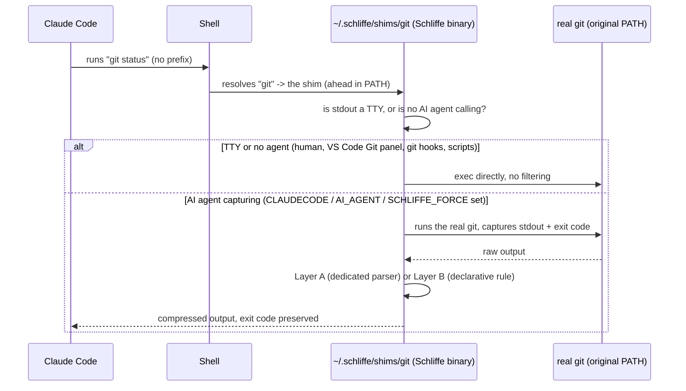

<div align="center">


**Cuts token waste in coding-agent sessions (Claude Code) — for real, without depending on Claude Code features we've already proven broken.**

[](LICENSE)
[](Cargo.toml)
[](https://github.com/mkmuniz/schliffe-tk/actions/workflows/ci.yml)

</div>

---

## Why this project exists

While setting up [RTK](https://github.com/rtk-ai/rtk) — the tool that inspired this project — we discovered, by testing it live, that its automatic command-rewriting mechanism depends on the `updatedInput` field returned by Claude Code's `PreToolUse` hooks. That field is **silently ignored on Windows** ([publicly confirmed issue, `anthropics/claude-code` #79321](https://github.com/anthropics/claude-code/issues/79321)). Without that mechanism, RTK never even gets invoked — there's no fallback.

We investigated two more hook candidates for solving the same kind of problem (`UserPromptSubmit`, `PostToolUse.updatedToolOutput`) — all three turned out broken or missing on this platform. Design conclusion: **no Schliffe mechanism can depend on a Claude Code hook to mutate a command, a prompt, or an output.** It has to intercept from the outside, in layers Claude Code doesn't even know exist.

Schliffe does this with a **`$PATH` shim** (the same decades-old technique used by `nvm`/`pyenv`/`asdf`) for shell commands, a **JSON-RPC protocol proxy** for MCP tools, and an **extractive summarization** function for prose — three axes of waste, three independent interception mechanisms, none of them dependent on a hook.

## What it optimizes

| Module (`borne`) | What it compresses | Mechanism | Status |
|---|---|---|---|
| `bornes/comandos` | Output of `git`, `cargo`, `pytest`, `docker`, `npm`, `pnpm`, `yarn`, `pip`, `dotnet`, `go`, `terraform` | `$PATH` shim — intercepts, filters, returns | ✅ Active, validated live |
| `bornes/mcp` | MCP tool schema (lazy loading) + call result | JSON-RPC proxy over stdio | ✅ Validated against a real server (`@modelcontextprotocol/server-filesystem`); opt-in per server |
| `bornes/hook` | Remote MCP results (HTTP/OAuth servers like Figma) + large images (MCP screenshots, images opened with Read) | Claude Code `PostToolUse` hook (`updatedToolOutput`) | ✅ macOS / Linux / WSL — ⚠️ **not native Windows** |
| `bornes/prosa` | Commit message body (`git log`/`git show`) | TF-IDF extractive summarization (no model, no embeddings) | ✅ Active, integrated into `comandos`'s Layer A |

Any other command (`ls`, `curl`, `make`, `jq`, ...) passes straight through, unfiltered — see [`KNOWN_ISSUES.md`](KNOWN_ISSUES.md) for full coverage details and what's missing.

## Measured results (not estimates)

Every percentage below is a real measurement, taken by running the binary against real repositories during this project's development — not an estimate, not a marketing number.

| Command | Raw | Schliffe | Reduction |
|---|---|---|---|
| `git status` (clean branch) | 174 B | 28 B | 84% |
| `git log -5` | 9,313 B | 907 B | 90.3% (one line per commit — all 5 stay visible) |
| `git show` (6-file diff) | 32,001 B | 5,740 B | 82.1% (RTK: 71.4% on the same diff) |
| `pytest` (collection error) | 3,245 B | 106 B | 96.7% (preserves the real error reason; RTK doesn't) |
| `docker images` (21 images) | 1,782 B | 1,234 B | 30.8% |
| `docker build` (3-step Dockerfile) | 1,719 B | 175 B | 89.8% |
| `npm install` (deprecated deps) | 675 B | 204 B | 69.8% |
| `pnpm build` (Next.js 16, 17 routes) | 1,071 B | 253 B | 76.4% |
| `git pull` (26 files) | 2,650 B | 208 B | 92.2% |
| `pnpm lint` (ESLint, 24 problems — all kept) | 3,317 B | 2,228 B | 32.8% |
| MCP `tools/list` (2 tools) | 1,047 B | 566 B | 45.9% |
| MCP `tools/list` (real filesystem server, 14 tools) | 13,018 B | 2,940 B | 77.4% |
| MCP `tools/call` (JSON result) | 16,658 B | 4,530 B | 72.8% |
| Repeated `git show <sha>` (cache) | — | — | ~23× faster, byte-identical |
| Repeated command (dedup) | 316 B | 75 B | short reference instead of the full text |

### Head-to-head with RTK (2026-09-26)

Same 25 real commands (two production repos + this one + scratch projects for build/lint/install/docker), measured with both tools, RTK v0.50.0:

| | RTK | Schliffe |
|---|---|---|
| Total reduction (all bytes) | −76.1% | −73.3% |
| **Median per command** | −56.2% | **−74.4%** |
| Commands with no rule | 2 (`pnpm build`, `npm install`) | 0 |

Where RTK still cuts more, it's mostly by dropping information Schliffe keeps on purpose: a large `git diff` is truncated after the first files (Schliffe shows every file, capping lines per file), `pnpm lint` loses each problem's line/column, and `docker images` drops image IDs.

Full detail on each measurement, methodology, and the cases where the technique **doesn't** help (documented with the same honesty) in [`MILESTONES.md`](MILESTONES.md) and [`specs.md`](specs.md) §10.

## Installation

Requires [Rust](https://rustup.rs) — the installer builds from source (there's no release/prebuilt-binary pipeline yet).

**Linux / macOS / WSL:**
```bash
git clone https://github.com/mkmuniz/schliffe-tk.git
cd schliffe-tk
bash install.sh
```

**Windows (native, outside WSL):**
```powershell
git clone https://github.com/mkmuniz/schliffe-tk.git
cd schliffe-tk
./install.ps1
```
> ⚠️ `install.ps1` has only been tested in safe mode (no full activation) — none of this project's development machines have native `git`/`cargo`/`npm` on Windows to validate it end to end. See [`KNOWN_ISSUES.md`](KNOWN_ISSUES.md).

After installing, open a new terminal (and reload VS Code / start a new Claude Code session). No need to prefix anything — when an AI agent runs `git status`, `git log`, `cargo test`, etc., the output already comes out filtered. Humans and regular scripts get the untouched output.

Opt-in/out per tool: `SCHLIFFE_FORCE=1` turns filtering on for an agent that doesn't set `CLAUDECODE`/`AI_AGENT`; `SCHLIFFE_DISABLE=1` turns it off (e.g. `SCHLIFFE_DISABLE=1 git diff > x.patch`).

## Remote MCP servers and images (Claude Code hook)

Some things never touch a shell or a local MCP pipe: **remote MCP servers** (HTTP + OAuth, e.g. Figma, `https://mcp.figma.com/mcp`) and **images** Claude opens with its Read tool or receives from an MCP tool (screenshots). For those, Schliffe plugs into Claude Code as a `PostToolUse` hook — **`install.sh` registers it automatically** when Claude Code is installed (`SCHLIFFE_NO_HOOK=1 bash install.sh` to skip). To manage it by hand:

```bash
schliffe hook install     # adds the hook to ~/.claude/settings.json (backup kept)
schliffe hook uninstall   # removes it
```

Open a new Claude Code session after installing. After each `Read` or `mcp__*` call, Claude Code hands the result to `schliffe hook post-tool-use`, which:

- compresses JSON text results of MCP tools (same rules as the stdio proxy: nulls dropped, long strings/arrays trimmed with an `schliffe show` hint; file-reading tools never touched);
- shrinks images whose long edge exceeds 1280px (`SCHLIFFE_IMAGE_MAX_EDGE`, `0` = off), keeping aspect ratio and format. Claude bills images by pixel area, and the API already downscales anything above ~1568px on the long edge or ~1.15 megapixels — so at the default 1280px the saving is modest (measured live: 2400×1500 image, −11%; a Retina screenshot ≈ −7%). Lower caps save much more (1024px ≈ −40%) at the cost of small UI text becoming harder to read.

Anything it doesn't recognize is left untouched (for built-in tools, Claude Code also discards a replacement that doesn't match the tool's output schema).

> ⚠️ **Not supported on native Windows** — Claude Code's hook output replacement was verified broken there (the reason this project avoided hooks in the first place). Works on macOS, Linux and WSL; `schliffe hook install` refuses to run on native Windows.

## Checking that it's saving

```bash
schliffe stats
```

Shows how many commands AI agents ran through Schliffe, how many were filtered, bytes before/after and estimated tokens saved (last 24h, 7 days, all time), the commands saving the most, and the ones that passed through with no filter yet (candidates for a new rule). Only the command name and sizes are logged (`~/.schliffe/stats.log`) — never arguments or output. `SCHLIFFE_NO_STATS=1` turns it off.

## Using the MCP proxy

MCP servers aren't intercepted automatically — wrap each one you want compressed by putting `schliffe mcp [--keep-schemas] --` in front of its command. In Claude Code:

```bash
claude mcp add filesystem -- schliffe mcp --keep-schemas -- npx -y @modelcontextprotocol/server-filesystem ~/projects
```

- **`--keep-schemas`** (recommended for Claude Code): leaves `tools/list` untouched and only compresses tool results. Claude Code already loads MCP tool schemas on demand through its own tool search, which relies on the full descriptions — shrinking them there costs more than it saves. Drop the flag for clients that load every schema up front.
- Results are compressed only when they're JSON (nulls dropped, long strings/arrays trimmed with an `schliffe show <hash>` recovery hint). Tools that read files (`read`, `file`, `cat`, `open`, `download` in the name, or listed in `SCHLIFFE_MCP_RAW_TOOLS=a,b`) are never touched, so a file's content always arrives intact.
- If the server dies mid-call, pending requests get a JSON-RPC error instead of hanging.

## How it works



Two filtering layers for `bornes/comandos`: **Layer A** (hand-written parsers for the highest-volume commands — `git status/log/diff/show`, `pytest`, `cargo test`) and **Layer B** (a declarative TOML rule engine for the long tail, `docker`/`npm`/`terraform`/etc., extensible without recompiling).

## Design principles (non-negotiable)

Motivated by a real, documented risk ([arXiv 2607.13071](https://arxiv.org/abs/2607.13071) — compression that turns "process interrupted" into "confirmed success" for an agent's later sessions):

1. Exit code always preserved and signaled unambiguously.
2. No "success"/"no changes" shortcut if the process failed or was interrupted.
3. **Fail-open**: an error in the filter lets the raw output through unmodified.
4. Raw output always recoverable (`schliffe show <hash>`).
5. Never falsify or infer a result — only reformats what actually came out.
6. **Filtered output can never be larger than the original** — if it doesn't shrink, it isn't applied.
7. Always inherits the parent process's own `$PATH`/environment — never resolves a binary on its own.

Full detail on each rule and the empirical evidence behind it: [`specs.md`](specs.md) §4.

## Project structure

```
src/
  main.rs        # entry point: meta-command (core::meta) vs shim (bornes::comandos)
  core/
    store.rs      # content-addressed store — cache, progressive disclosure, dedup
    meta.rs        # routes `schliffe show/store/compress/mcp`
  bornes/
    comandos/      # $PATH shim + Layer A (parsers) + Layer B (TOML rules)
    mcp/            # JSON-RPC proxy, schema lazy-loading + result compression
    prosa/          # TF-IDF extractive summarization
```

## Documentation

- [`specs.md`](specs.md) — full technical specification: architecture, business rules, the mechanics of each technique with real examples, the empirical RTK audit that drove the decisions.
- [`MILESTONES.md`](MILESTONES.md) — M0-M8 development history, with every live validation and the real bugs found along the way.
- [`KNOWN_ISSUES.md`](KNOWN_ISSUES.md) — known gaps and limitations, with context on why.
- [`TASKS.md`](TASKS.md) — actionable backlog derived from the known issues.

## Contributing

See [`CONTRIBUTING.md`](CONTRIBUTING.md).

## License

[Apache License 2.0](LICENSE).
