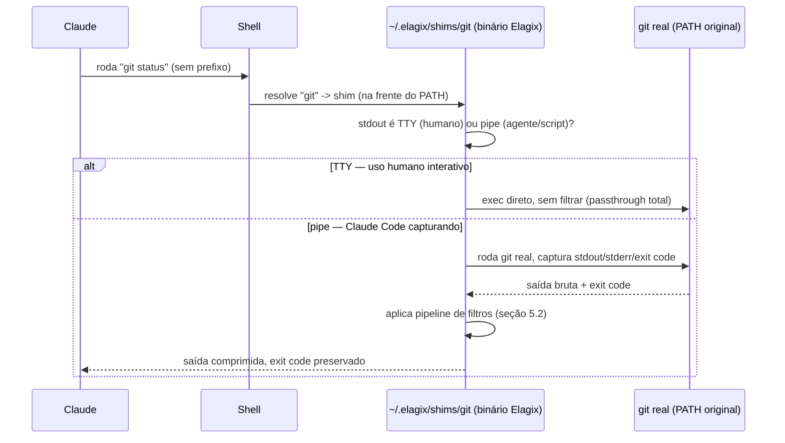

# Elagix — Especificação Técnica v1

> Status: arquitetura macro e técnicas principais **decididas** com base em pesquisa (RTK, snip, Headroom, mcp-compressor, context-compressor, papers acadêmicos) e validação empírica própria (450 execuções de benchmark de linguagem + auditoria de 64 comandos reais do RTK). O que resta em aberto está isolado na seção 13, pra virar milestones. Nada disso foi implementado ainda — isto é especificação.

---

## 1. Objetivo

Ferramenta (nome de trabalho: **Elagix**) que reduz o desperdício de tokens em sessões de agente de codificação (Claude Code) em três frentes: saída de comando de shell, definição/resultado de ferramenta MCP, e prosa em linguagem natural (mensagens de commit, prompts). Tudo determinístico e auditável — sem depender de recursos do Claude Code que já provamos frágeis ou ausentes em certas plataformas, e sem depender de modelo externo (exceto como extensão opcional, nunca no caminho padrão).

## 2. Por que não depender de hooks do Claude Code

Ao instalar o RTK (`rtk-ai/rtk`), confirmamos experimentalmente que o mecanismo de reescrita automática de comando dele depende do campo `updatedInput` retornado por hooks `PreToolUse` — e esse campo é **silenciosamente ignorado no Windows** (bug público confirmado: GitHub `anthropics/claude-code` issue #79321, `platform:windows`, `has repro`). Sem esse mecanismo, o RTK nunca é sequer invocado — não existe fallback.

Investigamos mais dois hooks candidatos a resolver problemas parecidos, com o mesmo resultado:

| Hook | O que prometia | Por que não serve |
|---|---|---|
| `PreToolUse.updatedInput` | Reescrever comando antes de rodar (abordagem do RTK) | Ignorado no Windows (#79321) |
| `UserPromptSubmit` | Substituir o prompt do usuário antes de chegar no modelo | **Não existe campo de substituição em nenhuma plataforma** — só `additionalContext` (que adiciona, não troca), e isso nem funciona na extensão VSCode (#49063, #15021) |
| `PostToolUse.updatedToolOutput` | Substituir resultado de uma ferramenta | Restrito de propósito a ferramentas MCP (pedido de extensão pra ferramentas nativas fechado sem implementar, #32105) e mesmo assim nunca dispara no Windows+VSCode (#27014) |

**Conclusão de design**: três hooks de mutação diferentes testados, três quebrados ou ausentes nesta plataforma. Nenhum mecanismo do Elagix pode depender de hook do Claude Code pra mutar algo (input, prompt ou output) — tem que interceptar por fora, em camadas que o Claude Code nem sabe que existem.

## 3. Arquitetura macro — os 3 `bornes`

**Decidido, 2026-07-26.** Escopo cobre três eixos de desperdício de token, cada um com mecanismo de interceptação próprio — não dá pra reaproveitar código de interceptação entre eles, só a filosofia e as regras de negócio (seção 4). Organizados como módulos autocontidos numa pasta `bornes/` (francês pra "borne" — a catraca/terminal onde se insere a ficha pra passar, ex: borne de métro — cada módulo é um ponto de passagem obrigatório):

```
elagix/
  bornes/
    comandos/   # shim de PATH — saída de comando de shell (git, docker, cargo, curl, wget, gh, aws, gcloud...)
    mcp/        # proxy de protocolo JSON-RPC — schema de ferramenta MCP (lazy-loading) + resultado de chamada
    prosa/      # função de compressão TF-IDF extrativa — chamada pelos outros dois bornes, sem interceptação própria
```

Implementado de verdade dentro de `src/` a partir do M8 (antes disso o código ficava mais achatado — ver MILESTONES.md, "Reestruturação de pastas"), com um `core/` a mais pra infraestrutura genuinamente cross-cutting (o armazém endereçado por hash da seção 8, que os três `bornes` podem usar):

```
src/
  main.rs        # ponto de entrada fino: meta-comando (core::meta) vs shim (bornes::comandos)
  core/          # store.rs (armazém), meta.rs (roteamento de `elagix show/store/compress/mcp`)
  bornes/
    comandos/    # shim.rs, filters/ (Camada A), camada_b/ (Camada B), filters-toml/ (dados)
    mcp/
    prosa/
```

| Borne | O que comprime | Mecanismo de interceptação | Depende de hook do Claude Code? |
|---|---|---|---|
| `bornes/comandos` | Saída de `git`, `docker`, `cargo`, `pytest`, `curl`, `wget`, `gh`, `aws`, `gcloud`, etc. | Shim de `$PATH` (técnica do nvm/pyenv/asdf/rbenv) | Não |
| `bornes/mcp` | Schema de ferramenta MCP + resultado de chamada de ferramenta MCP | Proxy de protocolo JSON-RPC (senta entre cliente e servidor) | Não |
| `bornes/prosa` | Corpo de mensagem de commit, rascunho de prompt (`/compress`) | N/A — é uma função chamada pelos outros dois bornes, não um ponto de interceptação | N/A |

## 4. Regras de negócio (aplicam aos três `bornes`)

Requisitos, não candidatos — motivados por um risco real e documentado (paper arXiv 2607.13071, "Compaction as Epistemic Failure": um caso real onde a saída truncada de um processo interrompido foi resumida como sucesso confirmado, e essa informação falsa se propagou como fato verdadeiro em sessões seguintes do agente).

1. **Exit code sempre preservado e sinalizado sem ambiguidade** — nunca escondido atrás de uma mensagem resumida.
2. **Nenhum atalho de "sucesso"/"sem mudanças" pode aparecer se o processo morreu, foi interrompido ou saiu com erro.** Importante (achado de implementação, M2, 2026-07-26): isso é responsabilidade de **cada filtro nunca fabricar sucesso**, não de desligar a filtragem inteira em qualquer saída não-zero — o caso de maior valor do `pytest` (falha de coleta) só existe justamente quando o exit code não é zero. Uma primeira implementação desligava o filtro nesse caso por engano, exatamente o oposto do pretendido.
3. **Fail-open**: qualquer erro interno do filtro deixa a saída bruta passar sem modificação — nunca falha escondendo dados.
4. **Saída bruta sempre recuperável** — via disclosure progressivo (seção 8).
5. **Nunca falsificar ou inferir resultado** — só reformata o que realmente saiu, nunca resume com base em suposição. Corolário (achado da seção 10, item de pytest): quando um curto-circuito por reconhecimento de padrão for usado, preservar pelo menos a última linha de erro real, não só uma contagem — mantém a economia sem sacrificar informação acionável.
6. **A saída filtrada nunca pode ser maior que a saída original** — se uma transformação resultaria em mais bytes que o input, descarta a transformação e devolve o original sem modificação. Motivado por achado empírico (seção 10): essa regra sozinha teria evitado quase todos os casos onde o RTK piorou a saída. Nenhuma técnica testada precisa dessa garantia desabilitada pra funcionar — é puro ganho, sem trade-off conhecido.
7. **Elagix sempre herda o mesmo `$PATH`/ambiente do processo que o invocou** — nunca resolve binários por conta própria (achado da seção 10: foi exatamente essa divergência que fez o RTK gerar um erro pior que o do shell nativo num teste nosso).

---

## 5. `bornes/comandos` — especificação

### 5.1 Mecanismo de interceptação: shim de `$PATH` (decidido)

Um executável com o mesmo nome do comando real (ex: `git`) fica numa pasta que vem **antes** do PATH real do sistema. Quando o shell resolve `git status`, encontra o shim primeiro.



**Por que este mecanismo e não o hook do Claude Code**: não depende de nenhum recurso do Claude Code (seção 2) — funciona em qualquer shell (Bash, PowerShell, cmd, zsh) e qualquer cliente, incluindo pra humanos digitando direto no terminal. Performance idêntica a um prefixo manual — o ganho é ergonomia e robustez, não velocidade.

**Detecção de TTY resolve de graça** o problema de comandos interativos (`git rebase -i`, paginação de `git log`, prompt de credencial): quando é um humano no terminal, passa direto sem filtrar. Só filtra quando a saída está sendo capturada de forma não-interativa.

**Limitação conhecida**: só funciona quando a resolução do comando passa pelo `$PATH` do shell — é exatamente como o Claude Code roda Bash/PowerShell (confirmado por nós), mas uma ferramenta que chame o binário por caminho absoluto direto não passaria pelo shim.

**Achado crítico do M8 (2026-07-26), que quase invalidou a ativação inteira**: "o `$PATH` tem o shim na frente" não é suficiente — depende de EM QUAL ARQUIVO de configuração de shell essa mudança de `$PATH` mora, porque isso muda com a combinação exata login/interativo com que o processo real é invocado, e diferentes combinações leem arquivos diferentes (é regra do bash, não do elagix). Confirmado ao vivo que o Claude Code (nesta configuração: extensão VSCode no Windows, WSL como backend de shell) invoca comando como `wsl -e bash -lc "..."` — **login, não-interativo**. `~/.bashrc` sozinho (onde a v0 do instalador colocava a linha) nunca roda nesse caso, por causa do guard `if not interactive, exit` que o `.bashrc` padrão do Ubuntu tem no topo. Fix (detalhado em MILESTONES.md, seção "Correção crítica pós-M8"): a mudança de PATH precisa estar em `~/.profile` (cobre login) **e** no topo de `~/.bashrc`, antes do guard (cobre não-login+interativo) — nenhum arquivo sozinho cobre as duas combinações reais de invocação. **Corolário pra qualquer plataforma nova**: antes de declarar a ativação "pronta" em qualquer sistema operacional/shell, precisa confirmar experimentalmente qual é o padrão exato de invocação de shell que o Claude Code usa NAQUELA plataforma — não dá pra assumir que generaliza do WSL/Linux.

### 5.2 Arquitetura de compressão: duas camadas (decidido)

| Camada | O que é | Por quê |
|---|---|---|
| **Camada A — parsers dedicados** | Código escrito à mão pros comandos de maior volume (`git status`, `git log`, `git diff`, `pytest`, `cargo test`) — entendem a estrutura real do formato | Evidência da seção 10: são as únicas categorias que renderam consistentemente ≥80% de redução. Todo o resto (Camada B, regra genérica) produziu uma cauda de 0% ou negativo |
| **Camada B — pipeline declarativo** | Motor de regras (regex/linha) configurável por arquivo, sem recompilar, pra cauda longa de comandos menos usados | Mais fácil de estender, mas com teto estrutural: só funciona quando o ruído específico que a regra procura aparece de fato (achado da seção 10, tipo de falha nº 3) |

**Decisão explícita, com evidência**: pipeline único genérico (sem Camada A) foi descartado — é exatamente esse tipo de abordagem que produziu as 16 categorias em 0% exato na auditoria do RTK (seção 10). Duas camadas, na mesma linha do RTK, é a arquitetura correta.

### 5.3 Catálogo de ações da Camada B

| Ação | O que faz |
|---|---|
| `strip_ansi` | Remove códigos de escape de cor/formatação |
| `replace` (regex linha-a-linha) | Substituição encadeável, suporta backreferences |
| `match_output` (curto-circuito) | Substitui a saída inteira por mensagem fixa se um padrão bater |
| `keep_lines` / `strip_lines_matching` | Filtro de linha por regex |
| `truncate_lines` | Corta cada linha em N caracteres |
| `head` / `tail` | Mantém primeiras/últimas N linhas |
| `max_lines` | Teto rígido de linhas |
| `on_empty` | Mensagem de fallback se tudo foi filtrado |
| `group_by` | Agrupa linhas por grupo de captura regex |
| `dedup` | Remove duplicatas (com normalização opcional) |
| `json_extract` / `json_schema` / `ndjson_stream` | Extração de campo, inferência de schema, streaming NDJSON |
| `regex_extract` | Captura grupos de regex |
| `state_machine` | Processamento multi-estado (usado em parsers de teste tipo pytest) |
| `aggregate` | Conta ocorrências de padrão |
| `format_template` | Formatação via template |
| `compact_path` | Abrevia caminhos de arquivo longos |
| Parsing de diff unificado | Entende headers `diff --git`/`---`/`+++`/`@@` pra tratar por arquivo |
| Filtro por nível pra código-fonte (None/Minimal/Aggressive) | Remove corpo de função mantendo assinatura; formatos de dado (JSON/YAML) sempre em modo brando |

### 5.4 Mecânica exata, com exemplos reais medidos nesta sessão

Isso **não usa embeddings nem nenhum modelo** — é manipulação de texto/string pura (regex, contagem de linha, parsing de formato conhecido). O regex classifica o texto em blocos e decide, por bloco: mantém verbatim, apaga inteiro, ou substitui por uma frase fixa — nunca reescreve/otimiza o texto que sobrevive. "Token" aqui é sempre a estimativa `caracteres/4` (seção 5.4.1). Cada exemplo é uma captura real, feita rodando o RTK de verdade nesta sessão, não um exemplo inventado.

**a) Curto-circuito por reconhecimento de padrão** (`git status`, `pytest`) — reconhece a saída inteira como pertencente a um padrão conhecido e substitui tudo por uma frase fixa.

```
ENTRADA (git status, 174 bytes ≈ 44 tokens):
  On branch feat/backlog-p0-p1-docs-project-ratelimit
  Your branch is up to date with 'origin/...'.

  nothing to commit, working tree clean

SAÍDA (27 bytes ≈ 7 tokens, -84,48%):
  clean — nothing to commit
```

```
ENTRADA (pytest com erro de import, 3.245 bytes ≈ 811 tokens):
  ============================= test session starts ==============================
  collected 0 items / 4 errors
  ==================================== ERRORS ====================================
  ____________________ ERROR collecting tests/test_client.py _____________________
  E   ModuleNotFoundError: No module named 'bastion_control_plane'
  [mais 3 erros parecidos]

SAÍDA (26 bytes ≈ 7 tokens, -99,2%):
  Pytest: No tests collected
```

**Achado importante**: no caso do pytest, o RTK reconhece "0 items / N errors" e troca por frase genérica — mas **perde o motivo real do erro**. Não é falsificação (regra 5), mas é perda de informação acionável. Corolário já incorporado na regra de negócio 5.

**b) Truncamento estrutural com corte duro** (`git log`) — processa item por item (delimitado por `commit <hash>`), mantém o primeiro quase completo e descarta o resto com uma contagem.

```
ENTRADA (git log -30, 39.559 bytes ≈ 9.890 tokens, 30 commits completos):
  commit cb93a3bd721a85b25c113413c8ed93b099bcc7f8
  Author: Mkmuniz <mikaelmuniz2001@gmail.com>
  Date:   Sat Jul 25 22:42:21 2026 -0300

      chore: cargo fmt (fix CI fmt-check failure)

      Never ran cargo fmt this session, only build/clippy/test -- the CI
      fmt-check gate caught real drift across committee.rs...
  commit e1fe7741ff3ba766ffb5bad8b039cd702d2f62e5
  ... [mais 28 commits completos]

SAÍDA (203 bytes ≈ 51 tokens, -99,49%):
  commit cb93a3bd721a85b25c113413c8ed93b099bcc7f8
    Author: Mkmuniz <mikaelmuniz2001@gmail.com>
    Date:   Sat Jul 25 22:42:21 2026 -0300
    chore: cargo fmt (fix CI fmt-check failure)
    [+592 lines omitted]
```

Economia real e sem perda grave (corpo de commit raramente é essencial), mas os outros 29 commits somem por completo — sem "recuperar sob demanda" isso é informação perdida (por isso a regra de negócio 4 exige disclosure progressivo). **Nota**: `bornes/prosa` (seção 7) melhora esse caso especificamente — resume o corpo em 1 frase em vez de descartar.

**c) Parsing estrutural de verdade** (`git diff`) — único padrão que entende o formato de verdade (headers `diff --git`, hunks `@@`) em vez de reconhecer-tudo ou cortar-por-item. Remove metadata do commit, mantém os hunks quase intactos:

```
SAÍDA (9.142 bytes ≈ 2.286 tokens, -71,43% — de 32.001 bytes ≈ 8.000 tokens):
  src/agent/committee.rs
    @@ -39,7 +39,7 @@ use bastion_memory::{BeliefDraft, Outcome, PrivacyTier, SharedMemory};
    -    CallConfig, ConveneReason, Message, MessageContent, ResponseMode, RouterDecision, Role,
    +    CallConfig, ConveneReason, Message, MessageContent, ResponseMode, Role, RouterDecision,
     };
    ...
```

As linhas `+`/`-` que sobrevivem ficam **exatamente iguais ao original** — por isso economiza menos (71% vs 99% dos outros exemplos): preserva conteúdo real em vez de substituir por frase.

**d) Sobrecarga de moldura fixa (os casos que pioram)** (`summary`, `find`) — mesmo mecanismo do item (a), mas a moldura é maior que o conteúdo quando a entrada já é pequena:

```
ENTRADA (find . -name build.rs, 11 bytes ≈ 3 tokens):
  ./build.rs

SAÍDA "summary" (98 bytes ≈ 25 tokens, CUSTOU +22 tokens):
  [ok] Command: find . -name build.rs
     2 lines of output

  Build Summary:
     [ok] Build successful
```

A moldura (texto fixo) é a mesma independente do tamanho da entrada. Coberto pela regra de negócio 6.

#### 5.4.1 De onde vem o "bytes/4 ≈ tokens"

Tokenizers reais usam BPE (Byte Pair Encoding) — agrupam sequências de bytes frequentes num único token, aprendido estatisticamente. **~4 caracteres por token** é um consenso aproximado pra texto em inglês (menos preciso pra código-fonte, JSON denso, ou português acentuado — tende a subestimar levemente). Mesma aproximação que RTK e snip usam — seguimos por consistência de comparação, não por precisão.

### 5.5 Técnicas específicas pra JSON/API (`curl`, `gh`, `aws`, `gcloud`, resultado de ferramenta MCP)

Quando o comando é uma chamada de API, o conteúdo tipicamente é JSON — pede técnicas diferentes de texto/log:

| Técnica | O que resolve |
|---|---|
| Compactação colunar de array-de-objetos | Chaves repetidas em cada item de um array (`{"id":1,...},{"id":2,...}`) custam token toda vez. Reformatar como colunas economiza mais que só compactar espaço em branco — é por isso que `rtk json` rendeu só 9,96% no nosso teste (seção 10), o mais fraco entre os "bons" |
| Poda de campo por relevância | Mesma filosofia do "estado default" do `git status` — a maioria dos campos de resposta de API (paginação, links HATEOAS, timestamps redundantes, IDs internos) não importa pro agente |
| Corte de valor de string longo | Trunca o VALOR de um campo específico (descrição longa, blob base64), mantendo a estrutura do objeto |
| Limite de profundidade | Evita estruturas aninhadas repetitivas (RTK já tem isso, `--depth`, padrão 5) |

Todas determinísticas, sem modelo externo. Compartilhadas com `bornes/mcp` (seção 6.2), já que resultado de ferramenta MCP também costuma ser JSON.

---

## 6. `bornes/mcp` — especificação

### 6.1 Mecanismo: proxy de protocolo com lazy-loading de schema

Inspirado no mecanismo do `atlassian-labs/mcp-compressor` (open-source, Rust) — **reimplementação própria**, não wrapper/dependência dele, pra manter controle e licença próprios (aceitando o esforço de engenharia maior: é um protocolo maduro — JSON-RPC sobre stdio/HTTP, streaming, potencialmente OAuth — que temos que resolver por conta).

```
1. Cliente MCP (Claude Code) pede lista de ferramentas
   → bornes/mcp responde só com wrappers genéricos (nome, sem schema completo)
2. Modelo decide que precisa da ferramenta X
   → chama get_tool_schema("X") → só aí bornes/mcp busca e devolve o schema completo no servidor real
3. Modelo invoca a ferramenta de verdade
   → bornes/mcp repassa a chamada pro servidor real
```

### 6.2 Compressão de resultado de chamada (escopo adicionado, 2026-07-26)

Além do lazy-loading de schema, `bornes/mcp` comprime o **resultado** da chamada antes de devolver — usando os mesmos filtros de JSON da seção 5.5 (resultado de ferramenta MCP costuma ser JSON).

**Achado que valida essa decisão**: investigamos se o hook `PostToolUse.updatedToolOutput` resolveria isso de forma mais simples, sem proxy. Não dá — é restrito a ferramentas MCP por design, e mesmo assim nunca dispara no Windows+VSCode (seção 2). Como `bornes/mcp` é um proxy de verdade (vê a chamada e o resultado nativamente, direto no protocolo), essa limitação do hook não o afeta — só ferramentas MCP ficam cobertas; ferramentas nativas do Claude Code (WebFetch, WebSearch) continuam fora de alcance, sem workaround conhecido, a menos que o usuário troque a ferramenta nativa por um servidor MCP equivalente.

---

## 7. `bornes/prosa` — especificação

### 7.1 Mecanismo: TF-IDF extrativo

Inspirado em `Huzaifa785/context-compressor`, que oferece 4 estratégias (extrativa via TF-IDF, abstrativa via transformer BART/T5, semântica via embeddings+k-means, híbrida). **Decisão explícita: só a estratégia extrativa entra.** Pontua frases por frequência/importância estatística (TF-IDF) e mantém só as de maior pontuação — sem modelo treinado, sem embedding, puro cálculo de frequência de palavra, implementável em Rust puro. As estratégias abstrativa/semântica/híbrida foram descartadas por reintroduzirem a dependência de modelo externo que o resto do Elagix evita (mesmo trade-off da "Compressão via modelo pequeno" descartada pra `bornes/comandos`).

Não tem mecanismo de interceptação próprio — é uma função chamada pelos outros dois `bornes` quando encontram um trecho de prosa.

### 7.2 Usos concretos

1. **Corpo de mensagem de commit** — chamado por `bornes/comandos` ao processar `git log`/`git show`. Hoje o RTK descarta o corpo inteiro (seção 5.4b); `bornes/prosa` resume em 1 frase em vez de apagar, preservando mais informação pelo mesmo custo aproximado de token. Implementado (M7, 2026-07-26): `git log` mostra `resumo: <frase>` no lugar de descartar o corpo do primeiro commit; `git show` ganhou de volta até o hash+assunto do commit (que antes sumiam por completo, junto do corpo — perda que ninguém tinha notado até essa revisão) mais o mesmo resumo de corpo.
2. **`/compress`** — **decisão revista durante a implementação do M7 (2026-07-26): NÃO vira uma chamada a `bornes/prosa`.** A ideia original (specs anteriores a esta revisão) presumia que era só trocar "compressão manual feita por mim" por uma chamada determinística. Reexaminando o `~/.claude/commands/compress.md` real na hora de fazer a integração, ficou claro que é uma tarefa diferente da que TF-IDF extrativo resolve: um rascunho de prompt precisa **cortar redundância dentro de cada frase** preservando 100% do conteúdo substantivo (números, nomes, restrições) — TF-IDF extrativo só sabe **descartar frases inteiras**, o que arrisca exatamente o que a regra de negócio 5 proíbe (perder um número/nome/restrição que estava numa frase de score baixo mas era essencial). Bom pra corpo de commit (perder uma frase secundária de contexto é aceitável); ruim pra prompt denso em restrições. `/compress` continua sendo julgamento semântico feito por mim, deliberadamente — não é uma lacuna a fechar depois, é a ferramenta certa pro problema. `bornes/prosa` ganhou um utilitário standalone equivalente (`elagix compress`, lê stdin, resume, imprime) pra quem quiser aplicar a técnica extrativa em prosa que tolera esse tipo de perda (corpo de commit fora do fluxo do `git log`, trecho de documentação longo etc.) — só não é o mecanismo por trás do slash command do usuário.

### 7.3 O que NÃO é automático (limite conhecido, não é bug)

Compressão de prompt do usuário **antes de chegar no modelo** não pode ser automática — investigamos a fundo (seção 2): não existe hook (`UserPromptSubmit`) que substitua texto de prompt em nenhuma plataforma, e um proxy externo (rede ou terminal) traria fragilidade e risco de alterar silenciosamente o que o usuário disse, o que viola o espírito da regra de negócio 5. `/compress`/`/c` continuam sendo ação explícita do usuário, por decisão de design — não é algo a "resolver" depois.

Duas razões independentes pra isso, não só uma (achado do M7, 2026-07-26, ver §7.2 item 2): mesmo se um hook de substituição de prompt existisse, `/compress` continuaria sendo julgamento semântico frase-a-frase (o que cortar preservando 100% do conteúdo substantivo), não seleção de frases inteiras — a técnica de `bornes/prosa` (TF-IDF extrativo) resolve um problema diferente do que `/compress` precisa.

---

## 8. Reversibilidade, cache e deduplicação (cross-cutting — aplica aos 3 `bornes`)

As três técnicas desta seção compartilham a mesma peça de infraestrutura: um **armazém local endereçado por hash** (conteúdo → hash → conteúdo original recuperável). Disclosure progressivo usa esse armazém pra reversibilidade; cache usa pra evitar reprocessar; dedup usa pra evitar reenviar o que já foi mostrado. Uma implementação, três usos.

### 8.1 Disclosure progressivo (reversibilidade)

Refinado a partir do mecanismo de lazy-loading do `mcp-compressor` (seção 6.1), generalizado pra resultado de comando/ferramenta, não só schema:

Em vez de sempre devolver o resultado comprimido inteiro, devolve por padrão só uma **manchete mínima** (ex: `"3 falhas — elagix show a3f9c pra detalhe"`) e só paga o custo de tokens do conteúdo completo se o agente pedir explicitamente. Precedente real e validado — é exatamente o padrão que o `mcp-compressor` já usa em produção pra schema de ferramenta (`get_tool_schema` sob demanda em vez de mandar tudo de cara).

Substitui as duas ideias mais simples que consideramos antes (tee em caso de falha do RTK; retrieval universal sob demanda do Headroom `CCR`) — cobre os mesmos casos e ainda economiza tokens no caminho feliz. Trade-off: uma ida-e-volta extra quando o agente realmente precisa do detalhe completo.

### 8.2 Cache de resultado (evita reprocessar, não só reenviar)

Pergunta de partida: se o mesmo comando roda de novo com o mesmo estado relevante, por que recalcular/refiltrar do zero? A chave é a **estratégia de invalidação**, que muda por tipo de conteúdo — cachear errado (servir resultado desatualizado) violaria a regra de negócio 5 (nunca falsificar resultado), então cada categoria abaixo só cacheia quando dá pra provar que nada mudou:

| Tipo de comando | Chave de cache | Por que é seguro |
|---|---|---|
| Git histórico imutável (`git show <sha>`, `git log` até um commit fixo) | comando + SHA resolvido | Uma vez computado, o resultado de um commit específico **nunca muda** — cache pra sempre, sem TTL |
| Git dependente de working tree (`git status`, `git diff` sem commit fixo) | comando + hash do `git diff --stat` ou mtime de `.git/index` | Invalida sozinho assim que algo no working tree muda — checagem barata antes de decidir se reusa o cache |
| Leitura de arquivo (`read`, `smart`) | caminho + mtime + tamanho (ou hash de conteúdo, se mtime não for confiável) | Idêntico ao que `make`/`ccache`/qualquer build system usa pra memoização — técnica comprovada |
| Chamada de ferramenta MCP | servidor + ferramenta + argumentos | Cache com TTL curto por padrão (servidor pode ter estado que muda sem aviso) — sem garantia de imutabilidade como o git |
| Build/teste (`cargo build`, `cargo test`) | **não cacheado por padrão** | Entradas ocultas demais (variável de ambiente, outros arquivos, estado de rede) pra garantir invalidação correta — risco de violar a regra 5 é maior que o ganho |

**Importante — isolar o que este mecanismo entrega**: cache (8.2) sozinho **não economiza nenhum token**. Ele evita rodar o comando real e o pipeline de filtro de novo — puramente tempo de execução local. O texto comprimido resultante é mandado pro modelo do mesmo jeito, venha ele de cache ou de execução fresca; o modelo não distingue os dois casos. Quem economiza token é a deduplicação (8.3), separadamente. As duas juntas resolvem os dois pedidos que motivaram esta seção (2026-07-26): token vem de 8.3, performance de rodar comando vem de 8.2 — mesmo armazém, mecanismos distintos, nenhum dos dois sozinho entrega os dois.

### 8.3 Deduplicação entre chamadas na mesma sessão (evita reenviar — é aqui que o token cai)

Complementar ao cache: mesmo que o comando precise rodar de novo (ou já tenha rodado uma vez só), se o **conteúdo comprimido resultante** for hash-idêntico a algo já mostrado nesta sessão, devolve uma referência curta em vez do texto inteiro de novo — ex: `"igual ao git status de a3f9c, sem mudança desde então"`. Usa o mesmo armazém do disclosure progressivo (8.1): o hash já existe, só precisa checar se ele já apareceu antes de decidir mandar o conteúdo completo de novo.

Isso cobre um padrão comum e caro em sessões longas de agente: rodar `git status` ou `ls` repetidamente pra "conferir o estado atual" — se nada mudou desde a última vez, a resposta devia custar quase nada. **Esta é a única das duas técnicas (8.2/8.3) que reduz token de fato** — 8.2 sozinha não reduziria nada.

**Limitação conhecida do v1 (2026-07-26)**: "mesma sessão" não tem um identificador confiável disponível pro shim — cada chamada é um processo novo, e o Claude Code não expõe um id de sessão estável no ambiente do processo filho. Aproximado por uma **janela deslizante de tempo** (`ELAGIX_DEDUP_WINDOW_SECS`, default 1.800s/30min) em vez de um limite de sessão de verdade: se o mesmo conteúdo (hash idêntico) já apareceu dentro da janela, conta como duplicata. Trade-off honesto — pode deduplicar entre duas sessões próximas no tempo, ou deixar de deduplicar dentro de uma sessão muito longa com gaps grandes. Só aplica a saídas acima de um tamanho mínimo (evita gastar uma linha de referência pra economizar uma dezena de bytes).

### 8.4 Compatibilidade com cache de prompt do provedor (Anthropic)

Diferente das três técnicas acima (que são do Elagix), esta é sobre não **atrapalhar** um mecanismo que já existe fora do nosso controle: a Anthropic cacheia prefixos de prompt repetidos entre chamadas de API (`cache_control`), o que já economiza tokens de reprocessamento pra tudo que fica estável entre turnos (system prompt, definição de ferramenta, histórico). Esse cache só funciona se o prefixo for **byte-a-byte idêntico** entre chamadas.

**Requisito de design derivado**: a saída do Elagix tem que ser **determinística** — mesmo input sempre produz o mesmo output, byte a byte (sem timestamp na moldura, sem ordenação não-determinística, sem qualquer variação cosmética entre execuções idênticas). Isso já é consequência natural das regras de negócio 5 e 6 (nunca inferir, nunca inflar), mas vale deixar explícito: **não introduzir não-determinismo em nenhuma camada** — quebraria tanto o cache do Elagix (8.2) quanto o cache de prompt do provedor.

### 8.5 Custo de recurso do armazém (RAM, disco, latência)

Análise feita em 2026-07-26, respondendo à pergunta "qual o impacto de salvar isso em disco":

- **RAM: desprezível por design**, desde que o armazém seja layout arquivo-por-hash (mesmo padrão do `.git/objects/`, ou do cache do npm/cargo) em vez de um índice carregado inteiro em memória. Cada chamada do shim lê só o arquivo específico do hash que precisa — sem banco de dados residente, sem índice em RAM. Cache de página do SO pode manter entradas quentes na memória por conta própria, mas isso é ganho de performance liberado automaticamente sob pressão de memória, não um custo que o Elagix controla ou precisa gerenciar.
- **Disco: real, cresce sem teto se não houver limpeza.** Estimativa grosseira pra uso normal (~100 comandos cacheáveis/dia, poucos KB cada — nossos próprios exemplos ficaram entre 27B e 9.142B de saída comprimida): ~100-500KB/dia, ~3-15MB/mês sem eviction nenhuma. Modesto, mas indefinido — precisa de política de limpeza desde o v1 (ver decisão pendente abaixo), não é algo pra adiar pra depois de já estar crescendo em produção.
- **Latência: pequena em termos absolutos, mas proporcionalmente relevante pro shim em si** — ler/escrever um arquivo pequeno soma frações de ms a poucos ms de I/O, o que é notável comparado ao startup puro do binário Rust (~1,5ms, seção 9), mas desprezível comparado ao comando real que ele embrulha (`git status`/`cargo build` já levam ordens de grandeza mais que isso sozinhos).

## 9. Stack e ambiente de implementação

**Decidido, 2026-07-26: Rust**, pros três `bornes`.

| Stack | Instalação cross-platform | Velocidade de desenvolvimento | Performance/startup |
|---|---|---|---|
| **Rust (escolhido)** | Difícil sem CI multi-target (é o que trava o RTK hoje) — **atualização M8 (2026-07-26): Windows cross-compilou de graça** via `mingw-w64` (nenhuma dependência do projeto usa C/FFI), rodado e validado de verdade no PowerShell nativo. **macOS confirmou a fricção prevista**: falha de link sem SDK/Xcode (`cc: unrecognized -arch/-mmacosx-version-min`), deferido até haver Mac real ou CI com runner macOS (ver MILESTONES.md M8) | Lenta (ownership/borrow checker) | Excelente |
| Go | Cross-compile trivial, ainda binário nativo | Rápida a moderada | Excelente |
| Node.js | `npm install -g` resolve PATH sozinho, mas depende de runtime instalado | Rápida | Ok (~50-100ms cold start) |
| Python | `pipx`, mas histórico de dor de cabeça com PATH no Windows | Rápida | Ok/lenta |
| Bun/Deno compilado | Binário único, mas embute runtime | Rápida (TypeScript) | Muito boa, mas não é binário "nativo puro" |

Benchmark próprio (3 protótipos idênticos em Rust/Go/Bun, 450 execuções, 5 fixtures reais capturadas de repositório real) confirmou Rust e Go essencialmente empatados em startup (~1,5ms vs ~2,3ms), Bun compilado ~13-15× mais lento que ambos mesmo como binário nativo (embute runtime). Rust escolhido apesar da fricção de cross-compile conhecida — a diferença de velocidade de desenvolvimento vs Go não pesou tanto quanto o teto de performance.

---

## 10. Achados empíricos que fundamentam essas decisões — auditoria dos 64 comandos do RTK (2026-07-26)

Levantamos os 63 filtros TOML da cauda longa direto do repositório RTK (`src/filters/*.toml`, não documentados no `rtk --help` — só descobertos via `rtk rewrite "<comando>"`) e rodamos as 64 categorias testáveis neste ambiente uma vez cada, via dashboard próprio (`bench/dashboard.html`, aba "Ranking RTK"). Dados brutos em `bench/all_categories_results.json`.

### 10.1 Distribuição por faixa de redução

| Faixa | Contagem | Exemplos |
|---|---|---|
| Ótimo (≥80%) | 16 | `cargo-test` 99,9%, `git-log` 99,5%, `pytest` 99,2%, `smart` 99,6%, `test-wrap` 99,7%, `rsync` 99,4%, `deps` 96,8%, `go-test` 96,8%, `pip-list` 93,9%, `dotnet-build` 93,5%, `format` 91,8%, `prettier` 92%, `ruff-check` 83,8%, `basedpyright` 83,6%, `git-status` 84,5%, `ps` 80,1% |
| Bom (50-80%) | 6 | `cargo-clippy` 78,1%, `ls-la` 72,8%, `docker-images` 72,7%, `git-diff` 71,4%, `lint` 55,7%, `golangci-lint` 53,8% |
| Pouco ou nada (0-50%) | 29 | 16 em **exatamente 0%** (passthrough total): `go-build`, `tsc`, `rg`, `docker-ps`, `read`, `du`, `make`, `ollama`, `jq`, `poetry`, `uv`, `mise`, `jj`, `nx`, `turbo`, `pre-commit`. Resto entre 1-42%: `grep`, `fd`, `tree`, `git-branch`, `wc`, `json`, `df`, `stat`, `shellcheck`, `yamllint`, `oxlint`, `terraform`, `ruff-format` |
| Piorou (negativo) | 13 | `summary` -790,9%, `find` -254,6% (pipe mode!), `pnpm-install` -64,3%, `err` -34,3%, `cargo-build` -23,4%, `biome` -18,9%, `task` -6,7%, `gcc` -5,8%, `mypy` -5,3%, `just` -4,0%, `systemctl` -2,7%, `ty` -2,1%, `markdownlint` -0,02% |

### 10.2 Tipos de comando onde o RTK não tem controle

Os 42 comandos das duas faixas de baixo se agrupam em 4 padrões:

1. **Sobrecarga de formatação fixa em resultados pequenos** (`summary`, `find`) — moldura de tamanho fixo custa mais que conteúdo minúsculo.
2. **Anotações de sucesso aditivas, não substitutivas** (`err`, `cargo-build`, `task`, `systemctl`, `just`, `gcc`, `ty`, `mypy`) — sempre acrescenta confirmação em vez de reconhecer "já está mínimo".
3. **Regras TOML são específicas a ruído conhecido, não entendem conteúdo** (16 em 0% exato + parte do 1-50%) — só ajudam quando o ruído específico aparece de fato.
4. **Divergência de PATH/ambiente entre RTK e o shell** (`pnpm-install`) — bug de plumbing, não de estratégia.

**Achado que muda a leitura**: em tokens absolutos (não %), `biome` custou ~1.179 tokens A MAIS numa execução real (entrada de 6.250 tokens) enquanto `summary` — pior % (-790%) — custou só 22 tokens a mais (entrada de 3 tokens). Porcentagem sozinha esconde onde o prejuízo real está.

### 10.3 Metodologia adotada pro Elagix, por tipo de falha

| Tipo de falha | Metodologia adotada |
|---|---|
| 1. Sobrecarga fixa em resultados pequenos | Filtro que reestrutura só aplica a forma elaborada acima de um limiar de itens/tamanho — seção 5.2/5.3 |
| 2. Anotação de sucesso aditiva | Regra de negócio 6 (seção 4): se a transformação não reduz, não aplica |
| 3. Regras de ruído específico sem efeito no caso limpo | Aceito como teto arquitetural de qualquer sistema de regras — por isso duas camadas (seção 5.2), não pipeline único |
| 4. Divergência de ambiente | Regra de negócio 7 (seção 4) |

---

## 11. Riscos e achados de pesquisa (contexto adicional)

- **Epistemic failure** (arXiv 2607.13071): compressão/resumo pode transformar "processo morreu no meio" em "sucesso confirmado" pra sessões seguintes — origem das regras de negócio 1-3.
- **Teto da poda estática** (arXiv 2604.04979 "Squeez", arXiv 2604.19572): regras fixas por comando são mensuravelmente piores que poda condicionada à tarefa/objetivo do agente — exigiria modelo treinado ou contexto de intenção repassado ao filtro. Não perseguido no v1 (contradiria a filosofia determinística), mas registrado como teto conhecido da abordagem de regras.
- **Efeito de diluição**: redução de tokens na saída de um comando não equivale a redução no custo total da sessão (prompt, histórico e system prompt também contam) — cuidado ao definir metas/marketing de "economia".
- **Taxas de eficiência reportadas por terceiros** (RTK: `cargo test` ~99%, `git diff` ~94%, `git log` ~86%, `git status` ~75%; Headroom: busca de código ~92%, debugging SRE ~92%, coding agent geral ~20%) — não auditadas por nós de forma independente (usamos nossa própria auditoria, seção 10, como referência principal). Todos usam `bytes/4` como estimador, nunca tokenizer real.

---

## 12. Glossário rápido

- **Borne**: módulo de interceptação autocontido (seção 3) — do francês, "catraca/terminal onde se insere a ficha".
- **Camada A / Camada B**: parser dedicado vs pipeline de regras declarativo (seção 5.2).
- **Disclosure progressivo**: devolver manchete mínima por padrão, detalhe completo só sob pedido (seção 8.1).
- **Armazém endereçado por hash**: infraestrutura compartilhada por disclosure progressivo, cache e dedup — conteúdo vira hash, hash recupera conteúdo original (seção 8).
- **`bytes/4`**: estimativa grosseira de tokens, não um tokenizer real (seção 5.4.1).

---

## 13. Decisões em aberto — pra virar milestones

Tudo que resta decidir tem escopo bem definido pelas seções acima; o que falta é definir *quanto* entra em cada fase, não mais *qual técnica* usar.

- [ ] **Escopo do v1 de `bornes/comandos`**: quais comandos ganham parser dedicado (Camada A) no v1 vs ficam só na Camada B genérica? Sugestão de partida: os mesmos de maior tráfego que já validamos (`git status/log/diff`, `pytest`, `cargo test`).
- [x] **Escopo do v1 de `bornes/mcp`** — **decidido e implementado (2026-07-26): lazy-loading básico de schema + compressão de resultado, só stdio.** OAuth e streaming HTTP remoto ficam pra depois — nenhum dos dois é necessário pro caso majoritário (servidor MCP local via stdio, que é como a maioria dos servidores configurados no Claude Code roda hoje).
- [x] **Escopo do v1 de `bornes/prosa`** — **decidido e implementado (2026-07-26): só corpo de commit (`git log`/`git show`) + utilitário standalone `elagix compress`.** `/compress` fica de fora (ver §7.2/§7.3 revisados: é uma tarefa diferente, não um caso de uso adiado). Resumir docstring/comentário longo em leitura de arquivo fica pra quando existir um parser de `read`/`smart` na Camada A — não tem onde plugar ainda.
- [x] **Formato de dado da Camada B (specs §5.2/§5.3)** — **decidido: TOML** (2026-07-26). Três motivos: (1) suporte de primeira classe e maduro no ecossistema Rust (crate `toml`, o mesmo formato do próprio Cargo — `serde_yaml`, o principal crate YAML de Rust, já foi arquivado pelo mantenedor original em certo ponto, evidenciando instabilidade relativa do lado YAML); (2) TOML é mais explícito e resistente a corrupção silenciosa (YAML tem sensibilidade a indentação que às vezes não gera erro de parse, só estrutura errada sem avisar, e coerção implícita de tipo — o "Norway problem", `NO` virando booleano) — isso vai direto contra as regras de negócio 3 e 5 (fail-open, nunca falsificar); (3) mesmo formato que o RTK já usa pra cauda longa, facilitando referência cruzada. `snip` escolheu YAML por ergonomia de string multi-linha em fixture de teste — trade-off que não compensa dado que confiabilidade pesa mais que ergonomia na filosofia do projeto.
- [x] **Escopo do v1 de cache (seção 8.2)** — **decidido (2026-07-26): só git histórico imutável, e só `git show <sha-explícito>`** (não `HEAD`, não `git log`, não working-tree). É o único caso onde "imutável" é comprovável sem heurística (um SHA explícito nunca muda de conteúdo; `HEAD`/branch podem apontar pra outro commit amanhã). Leitura de arquivo fica de fora do v1 (Camada A ainda não tem parser de `read`/`smart` — nada pra cachear ainda). Chave de cache inclui uma versão do formato do filtro (`git-show:v1:<sha>`) pra não servir saída de uma versão antiga do Elagix depois de o filtro mudar.
- [x] **Onde mora o armazém endereçado por hash (seção 8)** — **decidido: disco, `~/.elagix/store/`** (mesmo padrão de `~/.elagix/shims/`, configurável via `$ELAGIX_STORE_DIR`). Memória por processo não serviria pra nada — cada chamada do shim é um processo novo e curto (specs §5.1), então cache/dedup teriam vida zero sem persistir em disco. Layout arquivo-por-hash (specs §8.5), sem índice/banco residente em RAM.
- [x] **Política de limpeza do armazém em disco (seção 8.5)** — **decidido: expiração por idade, 14 dias, varredura preguiçosa** (sem daemon: a cada escrita no armazém, ~2% de chance de rodar uma varredura removendo arquivos com mtime mais velho que 14 dias — barato o bastante dado o volume estimado de KB/dia). Mais um comando manual de escape, `elagix store clear` (apaga tudo na hora) e `elagix store gc` (força a varredura já). 14 dias cobre confortavelmente o padrão de uso de uma sessão de trabalho contínua sem deixar o armazém crescer indefinidamente.
- [ ] **Nome final**: "Elagix" segue sendo o nome de trabalho, nunca formalmente confirmado como definitivo.
