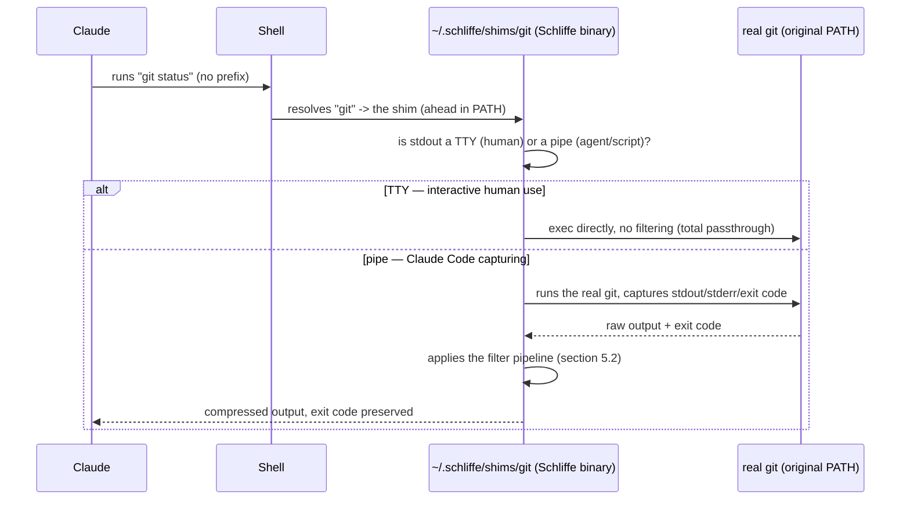

# Schliffe — Technical Specification v1

> Status: macro architecture and core techniques **decided** based on research (RTK, snip, Headroom, mcp-compressor, context-compressor, academic papers) and our own empirical validation (450 language-benchmark runs + an audit of 64 real RTK commands). What's still open is isolated in section 13, to become milestones. All of it has been implemented since — this document has been kept up to date as a living spec, not a pre-implementation plan.

---

## 1. Goal

A tool (working name: **Schliffe**) that reduces token waste in coding-agent sessions (Claude Code) on three fronts: shell command output, MCP tool definition/result, and natural-language prose (commit messages, prompts). Everything deterministic and auditable — without depending on Claude Code features we've already proven fragile or missing on certain platforms, and without depending on an external model (except as an optional extension, never on the default path).

## 2. Why not depend on Claude Code hooks

While installing RTK (`rtk-ai/rtk`), we confirmed experimentally that its automatic command-rewriting mechanism depends on the `updatedInput` field returned by `PreToolUse` hooks — and that field is **silently ignored on Windows** (publicly confirmed bug: GitHub `anthropics/claude-code` issue #79321, `platform:windows`, `has repro`). Without that mechanism, RTK is never even invoked — there's no fallback.

We investigated two more hook candidates for solving similar problems, with the same result:

| Hook | What it promised | Why it doesn't work |
|---|---|---|
| `PreToolUse.updatedInput` | Rewrite a command before it runs (RTK's approach) | Ignored on Windows (#79321) |
| `UserPromptSubmit` | Replace the user's prompt before it reaches the model | **No replacement field exists on any platform** — only `additionalContext` (which adds, doesn't replace), and even that doesn't work in the VSCode extension (#49063, #15021) |
| `PostToolUse.updatedToolOutput` | Replace a tool's result | Restricted by design to MCP tools (an extension request for native tools was closed without implementation, #32105), and even then it never fires on Windows+VSCode (#27014) |

**Design conclusion**: three different mutation hooks tested, three broken or missing on this platform. No Schliffe mechanism can depend on a Claude Code hook to mutate anything (input, prompt, or output) — it has to intercept from the outside, in layers Claude Code doesn't even know exist.

## 3. Macro architecture — the 3 `bornes`

**Decided, 2026-07-26.** Scope covers three axes of token waste, each with its own interception mechanism — interception code can't be reused between them, only the philosophy and the business rules (section 4). Organized as self-contained modules in a `bornes/` folder (French for "borne" — the turnstile/terminal where you insert a token to pass through, e.g. a métro borne — each module is a mandatory checkpoint):

```
schliffe/
  bornes/
    comandos/   # PATH shim — shell command output (git, docker, cargo, curl, wget, gh, aws, gcloud...)
    mcp/        # JSON-RPC protocol proxy — MCP tool schema (lazy-loading) + call result
    prosa/      # extractive TF-IDF compression function — called by the other two bornes, no interception of its own
```

Actually implemented inside `src/` starting from M8 (before that the code was flatter — see MILESTONES.md, "Folder restructuring"), with an extra `core/` for genuinely cross-cutting infrastructure (the content-addressed store from section 8, usable by all three bornes):

```
src/
  main.rs        # thin entry point: meta-command (core::meta) vs shim (bornes::comandos)
  core/          # store.rs (the store), meta.rs (routes `schliffe show/store/compress/mcp`)
  bornes/
    comandos/    # shim.rs, filters/ (Layer A), camada_b/ (Layer B), filters-toml/ (data)
    mcp/
    prosa/
```

| Borne | What it compresses | Interception mechanism | Depends on a Claude Code hook? |
|---|---|---|---|
| `bornes/comandos` | Output of `git`, `docker`, `cargo`, `pytest`, `curl`, `wget`, `gh`, `aws`, `gcloud`, etc. | `$PATH` shim (nvm/pyenv/asdf/rbenv technique) | No |
| `bornes/mcp` | MCP tool schema + MCP tool call result | JSON-RPC protocol proxy (sits between client and server) | No |
| `bornes/prosa` | Commit message body, prompt draft (`/compress`) | N/A — a function called by the other two bornes, not an interception point | N/A |

## 4. Business rules (apply to all three `bornes`)

Requirements, not candidates — motivated by a real, documented risk (paper arXiv 2607.13071, "Compaction as Epistemic Failure": a real case where a truncated output from an interrupted process was summarized as confirmed success, and that false information propagated as fact into the agent's later sessions).

1. **Exit code always preserved and signaled unambiguously** — never hidden behind a summarized message.
2. **No "success"/"no changes" shortcut may appear if the process died, was interrupted, or exited with an error.** Important (implementation finding, M2, 2026-07-26): this is each filter's own responsibility — **never fabricate success** — not something achieved by turning off filtering entirely on any non-zero exit. `pytest`'s highest-value case (collection failure) only exists precisely when the exit code is non-zero. An early implementation turned off the filter in exactly that case by mistake — the opposite of what was intended.
3. **Fail-open**: any internal filter error lets the raw output through unmodified — never fails by hiding data.
4. **Raw output always recoverable** — via progressive disclosure (section 8).
5. **Never falsify or infer a result** — only reformats what actually came out, never summarizes based on assumption. Corollary (finding from section 10, the pytest item): when a pattern-recognition shortcut is used, preserve at least the last real error line, not just a count — keeps the savings without sacrificing information needed to act on it.
6. **Filtered output can never be larger than the raw output** — if a transformation would result in more bytes than the input, discard the transformation and return the original unmodified. Motivated by an empirical finding (section 10): this rule alone would have prevented almost every case where RTK made output worse. No technique tested needs this guarantee disabled to work — it's pure upside, no known trade-off.
7. **Schliffe always inherits the same `$PATH`/environment as the process that invoked it** — never resolves binaries on its own (finding from section 10: it was exactly this kind of divergence that made RTK produce a worse error than the native shell in one of our tests).

---

## 5. `bornes/comandos` — specification

### 5.1 Interception mechanism: `$PATH` shim (decided)

An executable with the same name as the real command (e.g. `git`) sits in a folder that comes **before** the system's real PATH. When the shell resolves `git status`, it finds the shim first.



**Why this mechanism and not a Claude Code hook**: doesn't depend on any Claude Code feature (section 2) — works in any shell (Bash, PowerShell, cmd, zsh) and any client, including for humans typing directly into a terminal. Performance identical to a manual prefix — the gain is ergonomics and robustness, not speed.

**TTY detection solves for free** the problem of interactive commands (`git rebase -i`, `git log` pagination, a credential prompt): when it's a human at the terminal, it passes straight through unfiltered. It only filters when the output is being captured non-interactively.

**Known limitation**: only works when command resolution goes through the shell's `$PATH` — which is exactly how Claude Code runs Bash/PowerShell (confirmed by us), but a tool that calls the binary by an absolute path directly wouldn't go through the shim.

**Critical M8 finding (2026-07-26) that nearly invalidated the entire activation**: "the shim is ahead in `$PATH`" isn't enough by itself — it depends on WHICH shell config file that `$PATH` change lives in, because that changes with the exact login/interactive combination the real process is invoked with, and different combinations read different files (that's a bash rule, not an Schliffe one). Confirmed live that Claude Code (in this setup: VSCode extension on Windows, WSL as the shell backend) invokes commands as `wsl -e bash -lc "..."` — **login, non-interactive**. `~/.bashrc` alone (where installer v0 put the line) never runs in that case, because of the `if not interactive, exit` guard that Ubuntu's default `.bashrc` has at the top. Fix (detailed in MILESTONES.md, "Critical post-M8 fix" section): the PATH change needs to live in `~/.profile` (covers login) **and** at the top of `~/.bashrc`, before the guard (covers non-login+interactive) — no single file covers both real invocation combinations. **Corollary for any new platform**: before declaring activation "ready" on any OS/shell, you need to confirm experimentally the exact shell invocation pattern Claude Code uses on THAT platform — it can't be assumed to generalize from WSL/Linux.

### 5.2 Compression architecture: two layers (decided)

| Layer | What it is | Why |
|---|---|---|
| **Layer A — dedicated parsers** | Hand-written code for the highest-volume commands (`git status`, `git log`, `git diff`, `pytest`, `cargo test`) — understand the format's real structure | Evidence from section 10: these are the only categories that consistently delivered ≥80% reduction. Everything else (Layer B, a generic rule) produced a long tail of 0% or negative |
| **Layer B — declarative pipeline** | A rule engine (regex/line-based) configurable per file, no recompiling, for the long tail of less-used commands | Easier to extend, but with a structural ceiling: it only works when the specific noise a rule looks for actually shows up (finding from section 10, failure type #3) |

**Explicit decision, with evidence**: a single generic pipeline (no Layer A) was rejected — it's exactly that kind of approach that produced the 16 categories at exactly 0% in RTK's audit (section 10). Two layers, along the same lines as RTK, is the correct architecture.

### 5.3 Layer B action catalog

| Action | What it does |
|---|---|
| `strip_ansi` | Removes color/formatting escape codes |
| `replace` (line-by-line regex) | Chainable substitution, supports backreferences |
| `match_output` (short-circuit) | Replaces the whole output with a fixed message if a pattern matches |
| `keep_lines` / `strip_lines_matching` | Line filter by regex |
| `truncate_lines` | Cuts each line to N characters |
| `head` / `tail` | Keeps the first/last N lines |
| `max_lines` | Hard cap on line count |
| `on_empty` | Fallback message if everything got filtered out |
| `group_by` | Groups lines by a regex capture group |
| `dedup` | Removes duplicates (with optional normalization) |
| `json_extract` / `json_schema` / `ndjson_stream` | Field extraction, schema inference, NDJSON streaming |
| `regex_extract` | Captures regex groups |
| `state_machine` | Multi-state processing (used in test parsers like pytest's) |
| `aggregate` | Counts pattern occurrences |
| `format_template` | Template-based formatting |
| `compact_path` | Abbreviates long file paths |
| Unified diff parsing | Understands `diff --git`/`---`/`+++`/`@@` headers to handle per-file |
| Level-based filter for source code (None/Minimal/Aggressive) | Strips a function's body while keeping its signature; data formats (JSON/YAML) always stay in mild mode |

### 5.4 Exact mechanics, with real examples measured in this project

This is **not using embeddings or any model** — it's pure text/string manipulation (regex, line counting, parsing a known format). The regex classifies text into blocks and decides, per block: keep verbatim, drop entirely, or replace with a fixed phrase — it never rewrites/optimizes the text that survives. "Token" here is always the `characters/4` estimate (section 5.4.1). Every example is a real capture, taken by running the actual RTK during this project's research phase, not an invented example.

**a) Short-circuit by pattern recognition** (`git status`, `pytest`) — recognizes the whole output as belonging to a known pattern and replaces all of it with a fixed phrase.

```
INPUT (git status, 174 bytes ≈ 44 tokens):
  On branch feat/backlog-p0-p1-docs-project-ratelimit
  Your branch is up to date with 'origin/...'.

  nothing to commit, working tree clean

OUTPUT (27 bytes ≈ 7 tokens, -84.48%):
  clean — nothing to commit
```

```
INPUT (pytest with an import error, 3,245 bytes ≈ 811 tokens):
  ============================= test session starts ==============================
  collected 0 items / 4 errors
  ==================================== ERRORS ====================================
  ____________________ ERROR collecting tests/test_client.py _____________________
  E   ModuleNotFoundError: No module named 'bastion_control_plane'
  [3 more similar errors]

OUTPUT (26 bytes ≈ 7 tokens, -99.2%):
  Pytest: No tests collected
```

**Important finding**: for pytest, RTK recognizes "0 items / N errors" and swaps it for a generic phrase — but **loses the real reason for the error**. It's not falsification (rule 5), but it is a loss of actionable information. Corollary already baked into business rule 5.

**b) Structural truncation with a hard cutoff** (`git log`) — processes item by item (delimited by `commit <hash>`), keeps the first one almost complete and drops the rest with a count.

```
INPUT (git log -30, 39,559 bytes ≈ 9,890 tokens, 30 complete commits):
  commit cb93a3bd721a85b25c113413c8ed93b099bcc7f8
  Author: Mkmuniz <mikaelmuniz2001@gmail.com>
  Date:   Sat Jul 25 22:42:21 2026 -0300

      chore: cargo fmt (fix CI fmt-check failure)

      Never ran cargo fmt this session, only build/clippy/test -- the CI
      fmt-check gate caught real drift across committee.rs...
  commit e1fe7741ff3ba766ffb5bad8b039cd702d2f62e5
  ... [28 more complete commits]

OUTPUT (203 bytes ≈ 51 tokens, -99.49%):
  commit cb93a3bd721a85b25c113413c8ed93b099bcc7f8
    Author: Mkmuniz <mikaelmuniz2001@gmail.com>
    Date:   Sat Jul 25 22:42:21 2026 -0300
    chore: cargo fmt (fix CI fmt-check failure)
    [+592 lines omitted]
```

Real savings with no serious loss (a commit body is rarely essential), but the other 29 commits disappear entirely — without "recover on demand" that's lost information (which is why business rule 4 requires progressive disclosure). **Note**: `bornes/prosa` (section 7) improves this specific case — summarizes the body into 1 sentence instead of dropping it.

**c) True structural parsing** (`git diff`) — the only pattern that understands the real format (`diff --git` headers, `@@` hunks) instead of recognize-everything or cut-by-item. Strips commit metadata, keeps the hunks nearly intact:

```
OUTPUT (9,142 bytes ≈ 2,286 tokens, -71.43% — from 32,001 bytes ≈ 8,000 tokens):
  src/agent/committee.rs
    @@ -39,7 +39,7 @@ use bastion_memory::{BeliefDraft, Outcome, PrivacyTier, SharedMemory};
    -    CallConfig, ConveneReason, Message, MessageContent, ResponseMode, RouterDecision, Role,
    +    CallConfig, ConveneReason, Message, MessageContent, ResponseMode, Role, RouterDecision,
     };
    ...
```

The `+`/`-` lines that survive stay **exactly identical to the original** — which is why it saves less (71% vs. 99% for the other examples): it preserves real content instead of replacing it with a phrase.

**d) Fixed-frame overhead (the cases that got worse)** (`summary`, `find`) — same mechanism as item (a), but the frame is bigger than the content when the input is already small:

```
INPUT (find . -name build.rs, 11 bytes ≈ 3 tokens):
  ./build.rs

OUTPUT "summary" (98 bytes ≈ 25 tokens, COST +22 tokens):
  [ok] Command: find . -name build.rs
     2 lines of output

  Build Summary:
     [ok] Build successful
```

The frame (fixed text) is the same regardless of input size. Covered by business rule 6.

#### 5.4.1 Where "bytes/4 ≈ tokens" comes from

Real tokenizers use BPE (Byte Pair Encoding) — they group frequent byte sequences into a single token, learned statistically. **~4 characters per token** is a rough consensus for English text (less accurate for source code, dense JSON, or accented Portuguese — it tends to slightly underestimate). Same approximation RTK and snip use — we follow it for comparison consistency, not for precision.

### 5.5 Techniques specific to JSON/APIs (`curl`, `gh`, `aws`, `gcloud`, MCP tool result)

When the command is an API call, the content is typically JSON — that calls for different techniques than text/log:

| Technique | What it solves |
|---|---|
| Columnar compaction of array-of-objects | Repeated keys in every array item (`{"id":1,...},{"id":2,...}`) cost tokens every time. Reformatting as columns saves more than just compacting whitespace — which is why `rtk json` only scored 9.96% in our test (section 10), the weakest among the "good" ones |
| Field pruning by relevance | Same philosophy as `git status`'s "default state" — most API response fields (pagination, HATEOAS links, redundant timestamps, internal IDs) don't matter to the agent |
| Long string value truncation | Truncates the VALUE of a specific field (a long description, a base64 blob), keeping the object's structure |
| Depth limit | Avoids repetitive nested structures (RTK already has this, `--depth`, default 5) |

All deterministic, no external model. Shared with `bornes/mcp` (section 6.2), since MCP tool results also tend to be JSON.

---

## 6. `bornes/mcp` — specification

### 6.1 Mechanism: protocol proxy with schema lazy-loading

Inspired by the mechanism in `atlassian-labs/mcp-compressor` (open source, Rust) — **our own reimplementation**, not a wrapper/dependency on it, to keep our own control and license (accepting the larger engineering effort: it's a mature protocol — JSON-RPC over stdio/HTTP, streaming, potentially OAuth — that we have to handle ourselves).

```
1. MCP client (Claude Code) asks for the tool list
   → bornes/mcp responds with only generic wrappers (name, no full schema)
2. The model decides it needs tool X
   → calls get_tool_schema("X") → only then does bornes/mcp fetch and return the full schema from the real server
3. The model calls the real tool
   → bornes/mcp forwards the call to the real server
```

### 6.2 Call result compression (scope added 2026-07-26)

Besides schema lazy-loading, `bornes/mcp` compresses the call's **result** before returning it — using the same JSON filters from section 5.5 (MCP tool results tend to be JSON).

**Finding that validates this decision**: we looked into whether the `PostToolUse.updatedToolOutput` hook would solve this more simply, without a proxy. It can't — it's restricted to MCP tools by design, and even then it never fires on Windows+VSCode (section 2). Since `bornes/mcp` is a real proxy (it natively sees the call and the result, directly in the protocol), that hook limitation doesn't affect it — only MCP tools are covered; Claude Code's native tools (WebFetch, WebSearch) remain out of reach, with no known workaround, unless the user swaps the native tool for an equivalent MCP server.

---

## 7. `bornes/prosa` — specification

### 7.1 Mechanism: extractive TF-IDF

Inspired by `Huzaifa785/context-compressor`, which offers 4 strategies (extractive via TF-IDF, abstractive via a BART/T5 transformer, semantic via embeddings+k-means, hybrid). **Explicit decision: only the extractive strategy makes it in.** Scores sentences by statistical frequency/importance (TF-IDF) and keeps only the highest-scoring ones — no trained model, no embeddings, pure word-frequency computation, implementable in pure Rust. The abstractive/semantic/hybrid strategies were rejected because they'd reintroduce the external-model dependency the rest of Schliffe avoids (the same trade-off behind the rejected "small-model compression" idea for `bornes/comandos`).

Has no interception mechanism of its own — it's a function called by the other two `bornes` when they encounter a piece of prose.

### 7.2 Concrete uses

1. **Commit message body** — called by `bornes/comandos` while processing `git log`/`git show`. Today RTK drops the whole body (section 5.4b); `bornes/prosa` summarizes it into 1 sentence instead of erasing it, preserving more information for roughly the same token cost. Implemented (M7, 2026-07-26): `git log` shows `summary: <sentence>` instead of dropping the first commit's body; `git show` got back at least the commit's hash+subject (which used to disappear entirely, along with the body — a loss nobody had noticed until this revision) plus the same body summary.
2. **`/compress`** — **decision revised during M7's implementation (2026-07-26): it does NOT turn into a call to `bornes/prosa`.** The original idea (specs prior to this revision) assumed it was just a matter of swapping "manual compression done by me" for a deterministic call. Re-examining the real `~/.claude/commands/compress.md` while working on the integration made it clear this is a different task than what extractive TF-IDF solves: a prompt draft needs to **cut redundancy within each sentence** while preserving 100% of the substantive content (numbers, names, constraints) — extractive TF-IDF can only **drop whole sentences**, which risks exactly what business rule 5 forbids (losing a number/name/constraint that was in a low-scoring but essential sentence). Good for a commit body (losing a secondary context sentence is acceptable); bad for a prompt dense with constraints. `/compress` remains semantic judgment done by me, deliberately — it's not a gap to close later, it's the right tool for the problem. `bornes/prosa` gained an equivalent standalone utility (`schliffe compress`, reads stdin, summarizes, prints) for anyone who wants to apply the extractive technique to prose that can tolerate that kind of loss (a commit body outside the `git log` flow, a long documentation excerpt, etc.) — it's just not the mechanism behind the user's slash command.

### 7.3 What is NOT automatic (a known limit, not a bug)

Compressing the user's prompt **before it reaches the model** can't be automatic — we investigated this thoroughly (section 2): there's no hook (`UserPromptSubmit`) that replaces prompt text on any platform, and an external proxy (network or terminal) would introduce fragility and the risk of silently altering what the user said, which violates the spirit of business rule 5. `/compress`/`/c` remain an explicit user action, by design — it's not something to "solve" later.

Two independent reasons for this, not just one (finding from M7, 2026-07-26, see §7.2 item 2): even if a prompt-replacement hook existed, `/compress` would still require sentence-by-sentence semantic judgment (what to cut while preserving 100% of substantive content), not whole-sentence selection — `bornes/prosa`'s technique (extractive TF-IDF) solves a different problem than what `/compress` needs.

---

## 8. Reversibility, cache, and deduplication (cross-cutting — applies to all 3 `bornes`)

The three techniques in this section share the same piece of infrastructure: a **local content-addressed store** (content → hash → recoverable original content). Progressive disclosure uses this store for reversibility; cache uses it to avoid reprocessing; dedup uses it to avoid resending what's already been shown.

### 8.1 Progressive disclosure (reversibility)

Refined from `mcp-compressor`'s lazy-loading mechanism (section 6.1), generalized to a command/tool result, not just a schema:

Instead of always returning the entire compressed result, it returns, by default, just a **minimal headline** (e.g. `"3 failures — schliffe show a3f9c for detail"`) and only pays the token cost of the full content if the agent explicitly asks for it. A real, validated precedent — it's exactly the pattern `mcp-compressor` already uses in production for tool schema (`get_tool_schema` on demand instead of sending everything upfront).

Replaces the two simpler ideas we considered earlier (a tee on RTK failure; Headroom's `CCR` universal on-demand retrieval) — covers the same cases and still saves tokens on the happy path. Trade-off: one extra round trip when the agent genuinely needs the full detail.

### 8.2 Result cache (avoids reprocessing, not just resending)

Starting question: if the same command runs again with the same relevant state, why recompute/refilter from scratch? The key is the **invalidation strategy**, which changes per content type — caching incorrectly (serving a stale result) would violate business rule 5 (never falsify a result), so each category below only caches when it can prove nothing changed:

| Command type | Cache key | Why it's safe |
|---|---|---|
| Immutable git history (`git show <sha>`, `git log` up to a fixed commit) | command + resolved SHA | Once computed, a specific commit's result **never changes** — cache forever, no TTL |
| Working-tree-dependent git (`git status`, `git diff` with no fixed commit) | command + hash of `git diff --stat` or `.git/index` mtime | Invalidates on its own the moment something in the working tree changes — a cheap check before deciding to reuse the cache |
| File read (`read`, `smart`) | path + mtime + size (or content hash, if mtime isn't reliable) | Identical to what `make`/`ccache`/any build system uses for memoization — a proven technique |
| MCP tool call | server + tool + arguments | Short TTL cache by default (the server may have state that changes without notice) — no immutability guarantee like git's |
| Build/test (`cargo build`, `cargo test`) | **not cached by default** | Too many hidden inputs (environment variable, other files, network state) to guarantee correct invalidation — the risk of violating rule 5 outweighs the gain |

**Important — isolating what this mechanism delivers**: cache (8.2) alone **saves zero tokens**. It avoids re-running the real command and the filter pipeline — purely local execution time. The resulting compressed text gets sent to the model the same way regardless of whether it came from cache or a fresh run; the model can't tell the two cases apart. What saves tokens is deduplication (8.3), separately. Together the two answer the two requests that motivated this section (2026-07-26): tokens come from 8.3, command-execution performance comes from 8.2 — same store, distinct mechanisms, neither one alone delivers both.

### 8.3 Deduplication across calls in the same session (avoids resending — this is where tokens actually drop)

Complementary to the cache: even if the command needs to run again (or has only run once), if the **resulting compressed content** is hash-identical to something already shown this session, it returns a short reference instead of the full text again — e.g. `"same as the git status from a3f9c, unchanged since then"`. Uses the same store as progressive disclosure (8.1): the hash already exists, it just needs to check whether it's appeared before to decide whether to send the full content again.

This covers a common, expensive pattern in long agent sessions: running `git status` or `ls` repeatedly to "check the current state" — if nothing changed since last time, the answer should cost almost nothing. **This is the only one of the two techniques (8.2/8.3) that actually reduces tokens** — 8.2 alone wouldn't reduce anything.

**Known v1 limitation (2026-07-26)**: "same session" has no reliable identifier available to the shim — every call is a new process, and Claude Code doesn't expose a stable session id in the child process's environment. Approximated with a **sliding time window** (`SCHLIFFE_DEDUP_WINDOW_SECS`, default 1,800s/30min) instead of a real session boundary: if the same content (identical hash) already appeared within the window, it counts as a duplicate. An honest trade-off — it may deduplicate across two sessions close in time, or fail to deduplicate within one very long session with big gaps. Only applies to outputs above a minimum size (to avoid spending a reference line to save a handful of bytes).

### 8.4 Compatibility with the provider's prompt cache (Anthropic)

Unlike the three techniques above (which are Schliffe's own), this one is about not **interfering** with a mechanism that already exists outside our control: Anthropic caches repeated prompt prefixes across API calls (`cache_control`), which already saves reprocessing tokens for everything that stays stable between turns (system prompt, tool definitions, history). That cache only works if the prefix is **byte-for-byte identical** across calls.

**Derived design requirement**: Schliffe's output has to be **deterministic** — the same input always produces the same output, byte for byte (no timestamp in the frame, no non-deterministic ordering, no cosmetic variation whatsoever between identical runs). This is already a natural consequence of business rules 5 and 6 (never infer, never inflate), but it's worth stating explicitly: **never introduce non-determinism in any layer** — it would break both Schliffe's own cache (8.2) and the provider's prompt cache.

### 8.5 Store resource cost (RAM, disk, latency)

Analysis done on 2026-07-26, answering the question "what's the impact of saving this to disk":

- **RAM: negligible by design**, as long as the store uses a file-per-hash layout (the same pattern as `.git/objects/`, or npm/cargo's cache) instead of an index fully loaded into memory. Every shim call only reads the one file for the hash it needs — no resident database, no in-RAM index. The OS's page cache may keep hot entries in memory on its own, but that's a performance gain released automatically under memory pressure, not a cost Schliffe controls or needs to manage.
- **Disk: real, grows unbounded without cleanup.** Rough estimate for normal use (~100 cacheable commands/day, a few KB each — our own examples ranged from 27B to 9,142B of compressed output): ~100-500KB/day, ~3-15MB/month with no eviction at all. Modest, but unbounded — needs a cleanup policy from v1 (see decision below), not something to defer until it's already growing in production.
- **Latency: small in absolute terms, but proportionally relevant to the shim itself** — reading/writing a small file adds fractions of a ms to a few ms of I/O, which is noticeable compared to the Rust binary's own startup (~1.5ms, section 9), but negligible compared to the real command it wraps (`git status`/`cargo build` already take orders of magnitude longer on their own).

## 9. Stack and implementation environment

**Decided, 2026-07-26: Rust**, for all three `bornes`.

| Stack | Cross-platform install | Development speed | Performance/startup |
|---|---|---|---|
| **Rust (chosen)** | Hard without multi-target CI (what's blocking RTK today) — **M8 update (2026-07-26): Windows cross-compiled for free** via `mingw-w64` (no project dependency uses C/FFI), run and validated for real on native PowerShell. **macOS confirmed the expected friction**: link failure with no SDK/Xcode (`cc: unrecognized -arch/-mmacosx-version-min`), deferred until there's a real Mac or a macOS CI runner (see MILESTONES.md M8) | Slow (ownership/borrow checker) | Excellent |
| Go | Trivial cross-compile, still a native binary | Fast to moderate | Excellent |
| Node.js | `npm install -g` resolves PATH on its own, but depends on an installed runtime | Fast | OK (~50-100ms cold start) |
| Python | `pipx`, but a history of PATH headaches on Windows | Fast | OK/slow |
| Compiled Bun/Deno | Single binary, but embeds the runtime | Fast (TypeScript) | Very good, but not a "pure native" binary |

Our own benchmark (3 identical prototypes in Rust/Go/Bun, 450 runs, 5 real fixtures captured from a real repository) confirmed Rust and Go essentially tied on startup (~1.5ms vs ~2.3ms), compiled Bun ~13-15× slower than both even as a native binary (it embeds a runtime). Rust was chosen despite the known cross-compile friction — the development-speed gap vs. Go didn't weigh as much as the performance ceiling.

---

## 10. Empirical findings behind these decisions — an audit of RTK's 64 commands (2026-07-26)

We pulled the 63 long-tail TOML filters directly from RTK's repository (`src/filters/*.toml`, undocumented in `rtk --help` — only discovered via `rtk rewrite "<command>"`) and ran the 64 testable categories once each in this environment, via our own dashboard (`bench/dashboard.html`, "RTK Ranking" tab). Raw data in `bench/all_categories_results.json`.

### 10.1 Distribution by reduction range

| Range | Count | Examples |
|---|---|---|
| Excellent (≥80%) | 16 | `cargo-test` 99.9%, `git-log` 99.5%, `pytest` 99.2%, `smart` 99.6%, `test-wrap` 99.7%, `rsync` 99.4%, `deps` 96.8%, `go-test` 96.8%, `pip-list` 93.9%, `dotnet-build` 93.5%, `format` 91.8%, `prettier` 92%, `ruff-check` 83.8%, `basedpyright` 83.6%, `git-status` 84.5%, `ps` 80.1% |
| Good (50-80%) | 6 | `cargo-clippy` 78.1%, `ls-la` 72.8%, `docker-images` 72.7%, `git-diff` 71.4%, `lint` 55.7%, `golangci-lint` 53.8% |
| Little or nothing (0-50%) | 29 | 16 at **exactly 0%** (total passthrough): `go-build`, `tsc`, `rg`, `docker-ps`, `read`, `du`, `make`, `ollama`, `jq`, `poetry`, `uv`, `mise`, `jj`, `nx`, `turbo`, `pre-commit`. The rest between 1-42%: `grep`, `fd`, `tree`, `git-branch`, `wc`, `json`, `df`, `stat`, `shellcheck`, `yamllint`, `oxlint`, `terraform`, `ruff-format` |
| Got worse (negative) | 13 | `summary` -790.9%, `find` -254.6% (pipe mode!), `pnpm-install` -64.3%, `err` -34.3%, `cargo-build` -23.4%, `biome` -18.9%, `task` -6.7%, `gcc` -5.8%, `mypy` -5.3%, `just` -4.0%, `systemctl` -2.7%, `ty` -2.1%, `markdownlint` -0.02% |

### 10.2 Types of commands where RTK has no control

The 42 commands in the two bottom ranges group into 4 patterns:

1. **Fixed-formatting overhead on small results** (`summary`, `find`) — a fixed-size frame costs more than tiny content.
2. **Additive, not substitutive, success annotations** (`err`, `cargo-build`, `task`, `systemctl`, `just`, `gcc`, `ty`, `mypy`) — always adds a confirmation instead of recognizing "this is already minimal".
3. **TOML rules are specific to known noise, they don't understand content** (16 at exactly 0% plus part of the 1-50% range) — only help when the specific noise actually shows up.
4. **PATH/environment divergence between RTK and the shell** (`pnpm-install`) — a plumbing bug, not a strategy failure.

**A finding that changes the reading**: in absolute tokens (not %), `biome` cost ~1,179 tokens MORE in a real run (a 6,250-token input) while `summary` — with the worse % (-790%) — only cost 22 tokens more (a 3-token input). Percentage alone hides where the real damage is.

### 10.3 Methodology adopted for Schliffe, by failure type

| Failure type | Methodology adopted |
|---|---|
| 1. Fixed overhead on small results | The restructuring filter only applies its elaborate form above an item-count/size threshold — section 5.2/5.3 |
| 2. Additive success annotation | Business rule 6 (section 4): if the transformation doesn't reduce, don't apply it |
| 3. Specific-noise rules with no effect on the clean case | Accepted as the architectural ceiling of any rule-based system — hence two layers (section 5.2), not a single pipeline |
| 4. Environment divergence | Business rule 7 (section 4) |

---

## 11. Risks and research findings (additional context)

- **Epistemic failure** (arXiv 2607.13071): compression/summarization can turn "process died mid-run" into "confirmed success" for an agent's later sessions — the origin of business rules 1-3.
- **The static-pruning ceiling** (arXiv 2604.04979 "Squeez", arXiv 2604.19572): fixed per-command rules are measurably worse than pruning conditioned on the agent's task/goal — would require a trained model or intent context passed to the filter. Not pursued in v1 (would contradict the deterministic philosophy), but recorded as the rule-based approach's known ceiling.
- **Dilution effect**: a token reduction in one command's output doesn't equal a reduction in the session's total cost (prompt, history, and system prompt also count) — be careful when setting "savings" goals/marketing based on this.
- **Efficiency rates reported by third parties** (RTK: `cargo test` ~99%, `git diff` ~94%, `git log` ~86%, `git status` ~75%; Headroom: code search ~92%, SRE debugging ~92%, general coding agent ~20%) — not independently audited by us (we use our own audit, section 10, as the primary reference). All of them use `bytes/4` as an estimator, never a real tokenizer.

---

## 12. Quick glossary

- **Borne**: a self-contained interception module (section 3) — French for "turnstile/terminal where you insert a token".
- **Layer A / Layer B**: dedicated parser vs. declarative rule pipeline (section 5.2).
- **Progressive disclosure**: returning a minimal headline by default, full detail only on request (section 8.1).
- **Content-addressed store**: shared infrastructure for progressive disclosure, cache, and dedup — content becomes a hash, a hash recovers the original content (section 8).
- **`bytes/4`**: a rough token estimate, not a real tokenizer (section 5.4.1).

---

## 13. Open decisions — to become milestones

Everything left to decide has well-defined scope from the sections above; what's missing is deciding *how much* goes into each phase, not *which technique* to use anymore.

- [ ] **v1 scope for `bornes/comandos`**: which commands get a dedicated parser (Layer A) in v1 vs. staying on the generic Layer B? Starting suggestion: the same highest-traffic ones we've already validated (`git status/log/diff`, `pytest`, `cargo test`).
- [x] **v1 scope for `bornes/mcp`** — **decided and implemented (2026-07-26): basic schema lazy-loading + result compression, stdio only.** OAuth and remote HTTP streaming are left for later — neither is necessary for the majority case (a local MCP server over stdio, which is how most servers configured in Claude Code run today).
- [x] **v1 scope for `bornes/prosa`** — **decided and implemented (2026-07-26): commit body only (`git log`/`git show`) + the standalone `schliffe compress` utility.** `/compress` is left out (see revised §7.2/§7.3: it's a different task, not a deferred use case). Summarizing a long docstring/comment during a file read is left for whenever a `read`/`smart` parser exists in Layer A — there's nowhere to plug it in yet.
- [x] **Layer B data format (specs §5.2/§5.3)** — **decided: TOML** (2026-07-26). Three reasons: (1) first-class, mature support in the Rust ecosystem (the `toml` crate, the same format Cargo itself uses — `serde_yaml`, Rust's main YAML crate, was archived by its original maintainer at one point, evidence of relative instability on the YAML side); (2) TOML is more explicit and resistant to silent corruption (YAML has indentation sensitivity that sometimes produces no parse error, just wrong structure with no warning, plus implicit type coercion — the "Norway problem", `NO` becoming a boolean) — that goes directly against business rules 3 and 5 (fail-open, never falsify); (3) the same format RTK already uses for its long tail, making cross-referencing easier. `snip` chose YAML for multi-line string ergonomics in test fixtures — a trade-off that doesn't pay off given that reliability outweighs ergonomics in this project's philosophy.
- [x] **v1 scope for cache (section 8.2)** — **decided (2026-07-26): only immutable git history, and only `git show <explicit-sha>`** (not `HEAD`, not `git log`, not the working tree). It's the only case where "immutable" is provable without a heuristic (an explicit SHA never changes content; `HEAD`/a branch can point to a different commit tomorrow). File reading is left out of v1 (Layer A still has no `read`/`smart` parser — nothing to cache yet). The cache key includes a filter format version (`git-show:v1:<sha>`) so it never serves output from an old Schliffe version after the filter changes.
- [x] **Where the content-addressed store lives (section 8)** — **decided: disk, `~/.schliffe/store/`** (same pattern as `~/.schliffe/shims/`, configurable via `$SCHLIFFE_STORE_DIR`). Per-process memory wouldn't serve any purpose — every shim call is a new, short-lived process (specs §5.1), so cache/dedup would have zero lifespan without persisting to disk. File-per-hash layout (specs §8.5), no resident index/database in RAM.
- [x] **Disk store cleanup policy (section 8.5)** — **decided: age-based expiration, 14 days, a lazy sweep** (no daemon: every store write has a ~2% chance of running a sweep that removes files with an mtime older than 14 days — cheap enough given the estimated KB/day volume). Plus a manual escape hatch, `schliffe store clear` (wipes everything immediately) and `schliffe store gc` (forces the sweep right away). 14 days comfortably covers a continuous work session's usage pattern without letting the store grow indefinitely.
- [x] **Final name** — **decided: "Schliffe"** (2026-07-26). Formerly a working name ("Jeton"), formally confirmed as final after exploring several naming directions (French vocabulary, wordplay, Clair Obscur-themed, Japanese/German/Russian options) — chosen from the "élagage"/"élagueur" family (French for pruning/trimming), matching the project's own metaphor of cutting excess while keeping what matters.
